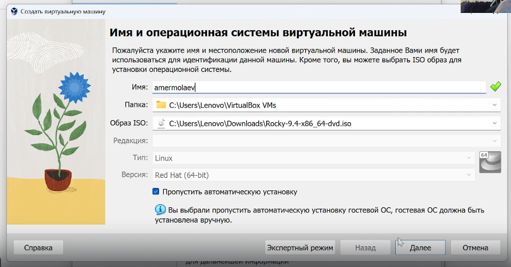
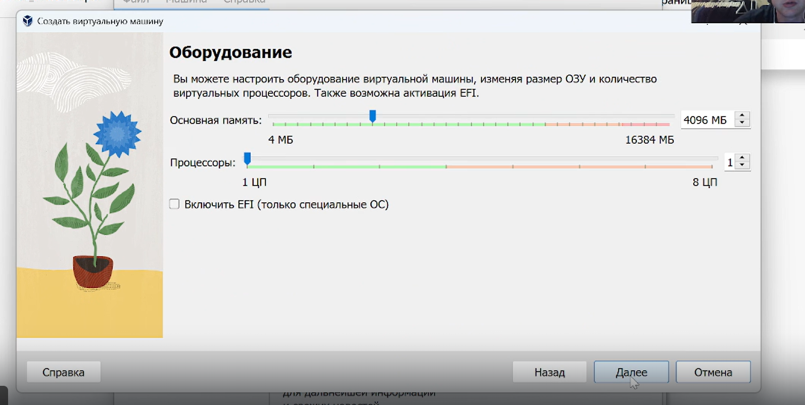
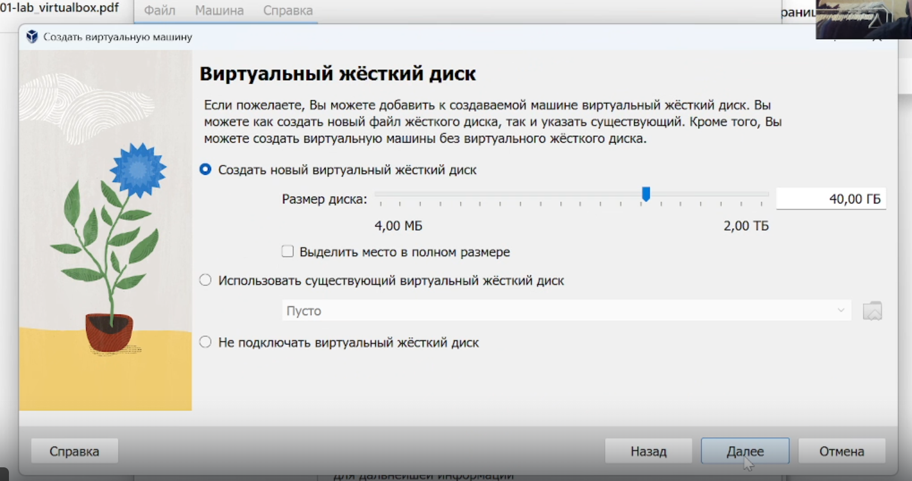
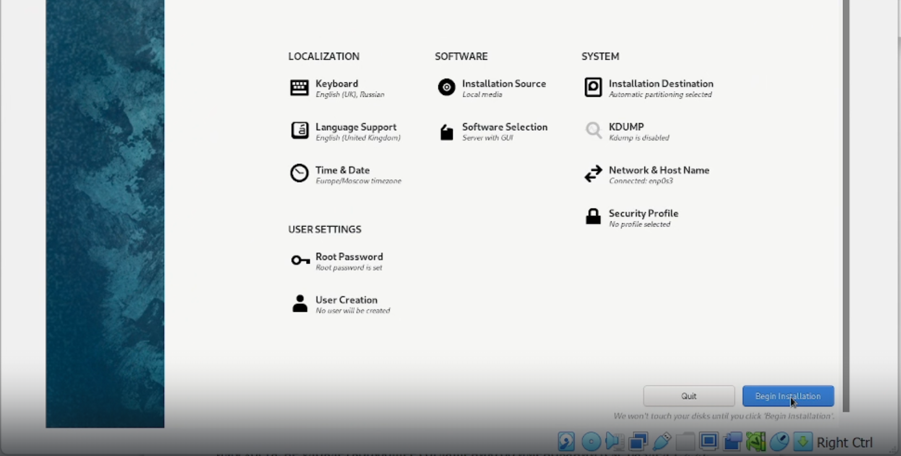
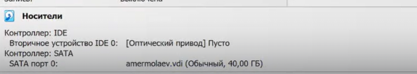
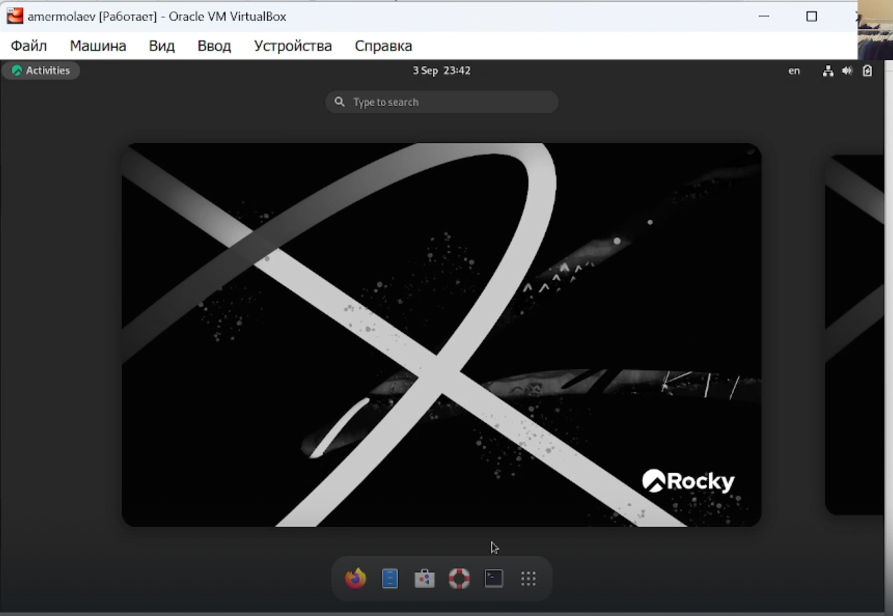
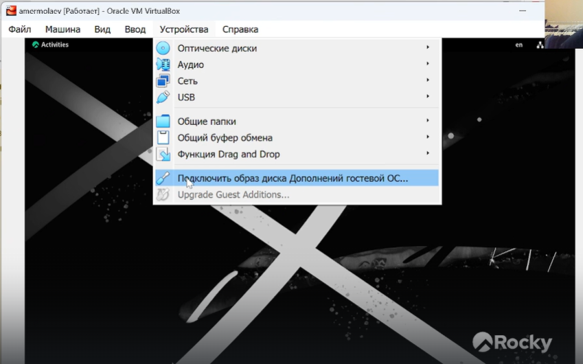
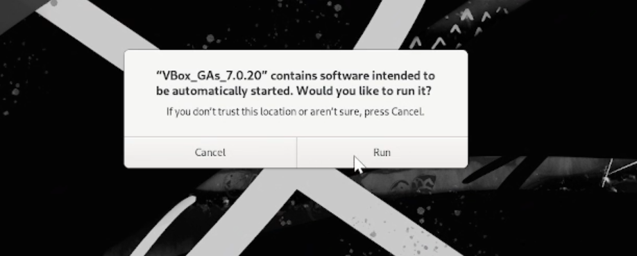
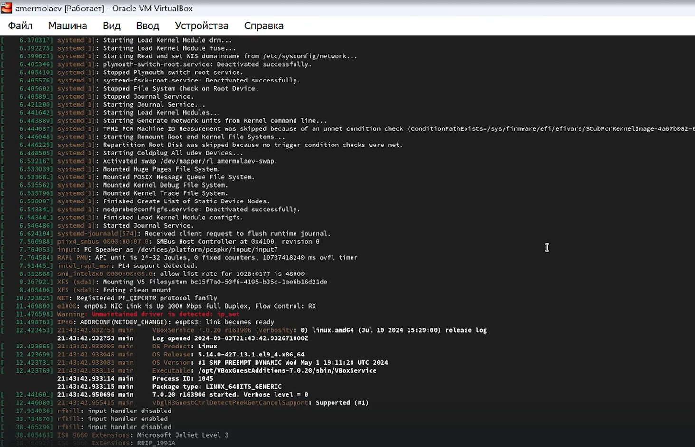
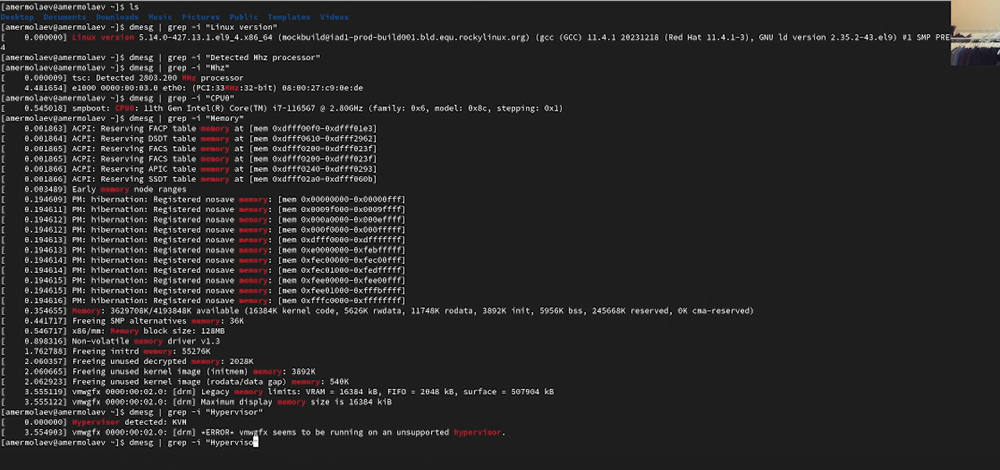

---
## Front matter
lang: ru-RU
title: Презентация к лабораторной работе №1
author: Ермолаев А.М.
group: НПМбд-01-21

## Formatting
toc: false
slide_level: 2
theme: metropolis
header-includes: 
 - \metroset{progressbar=frametitle,sectionpage=progressbar,numbering=fraction}
 - '\makeatletter'
 - '\beamer@ignorenonframefalse'
 - '\makeatother'
aspectratio: 43
section-titles: true
---

# Презентация к лабораторной работе №1

# Цель работы

Приобрести практический навык установки операционной системы на виртуальную машину и настройки минимально необходимых для дальнейшей работы сервисов.

# Выполнение работы

## Начальная конфигурация машины

## Выбор размера основной памяти

## Настройка виртуального жесткого диска  

## Первый запуск  

## Выбор предустановочных настроек

## Проверка извлеченного диска

## Запуск установленной ОС

## Установка  Guest Additions

## Выполнение домашнего задания

# Вывод
## В рамках выполнения данной лабораторной работы я обрел практический навык установки операционной системы на виртуальную машину и настройки минимально необходимых для дальнейшей работы сервисов.

# Финал
