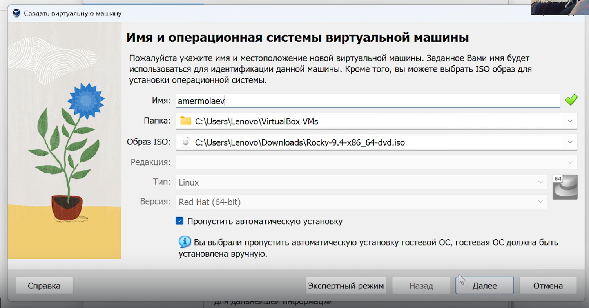
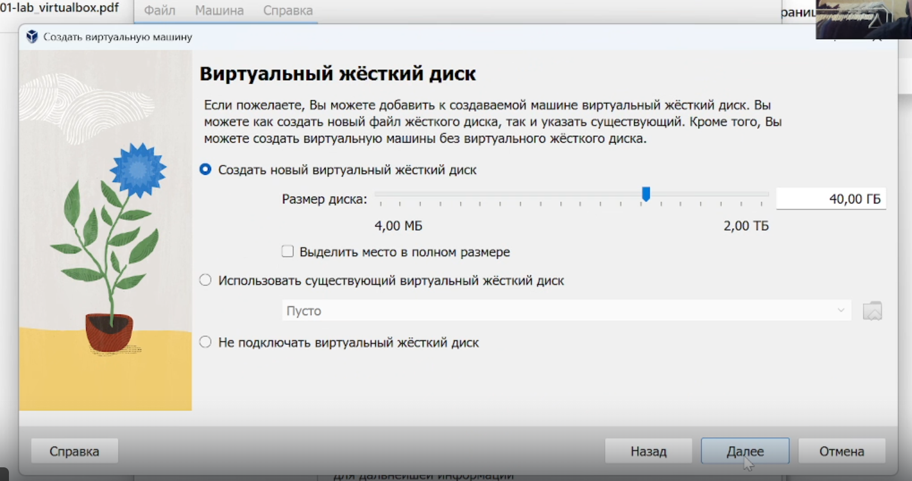
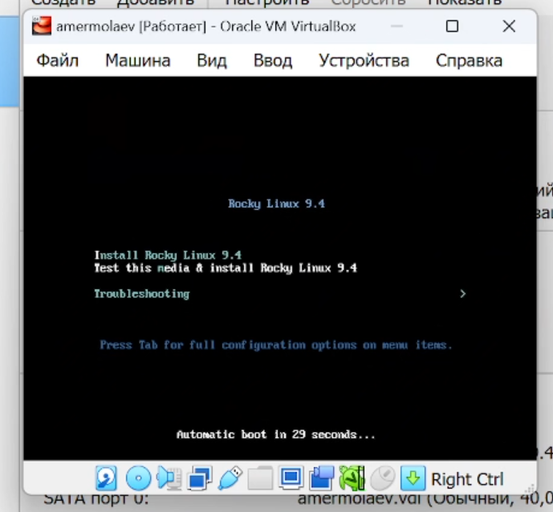
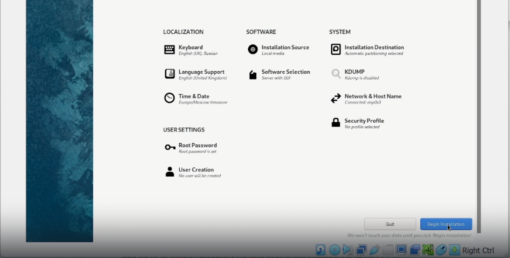
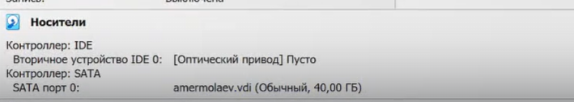
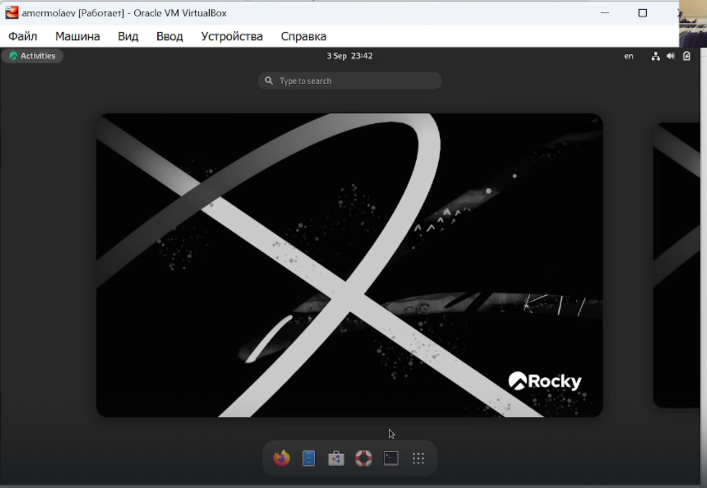
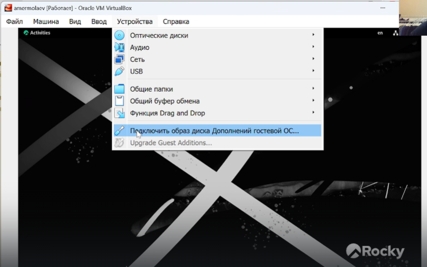
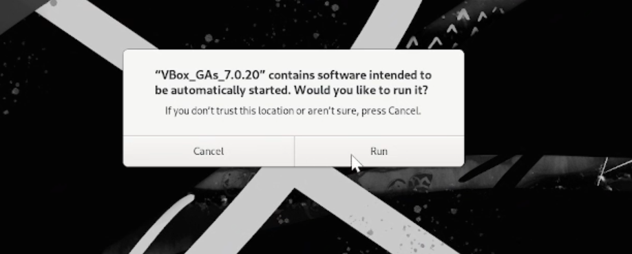

# **Отчет к лабораторной работе №1**
## **Common information**
discipline: ОСновы информационной безопасности  
group: НПМбд-01-21  
author: Ермолаев А.М.
---
---
## **Цель работы**
Приобретение практических навыков установки операционной системы на виртуальную машину и настройки минимально необходимых для дальнейшей работы сервисов.
## **Выполнение работы**
Установим на виртуальную машину
[VirtualBox](https://www.virtualbox.org/) операционной системы [Rocky Linux](ttps://rockylinux.org/).


Создадим новую виртуальную машину, выбрав опции

```
Машина -> Создать
```

Укажем имя виртуальной машины (amermolaev), тип
операционной системы (Linux, RedHat) и загрузим скаченный ранее образ в соответсвующее поле.



Укажем размер основной памяти виртуальной машины - 4096 МБ и кол-во выделенных ядер процессора - 1.


Зададим конфигурацию виртуального жёсткого диска — загрузочный, VDI, динамический, размером 40 ГБ 



Подтвердим все выбранные настройки и запустим созданную виртуальную машину.

!



Проделаем следующие дейтсвия перед установкой:
* Выберим English в качестве языка интерфейса
* Скорректируем часовой пояс, раскладку клавиатуры
* В разделе выбора программ укажем в качестве базового окружения Server with GUI , а в качестве дополнения — Development Tools.
* Отключим KDUMP.
* Включим сетевое соединение и в качестве имени узла укажем aermolaev.localdomain.
* Установим пароль для root и пользователя с правами администратора.



После установки перезапустим виртуальную машину зайдем под root, предварительно проверив, что
устройство в разделе “Носители” пусто.





Важным моментом для комфортной работы является установка дополнений для гостевой ОС Guest Additions.
Для этого во вкладке "Устройства" выберем "Подключить образ диска Дополненной гостевой ОС"





И проследуем всем инструкциям на экране, после чего перезапустим вируальную машину.
  
После перезапуска машины выполним домашнее задание:
В окне терминала проанализируем последовательность загрузки системы, выполнив команду dmesg:


При помощи команды dmesg с различными опциями получим следующую информацию:
1. Версия ядра Linux (Linux version).
2. Частота процессора (Detected Mhz processor).
3. Модель процессора (CPU0).
4. Объем доступной оперативной памяти (Memory available).
5. Тип обнаруженного гипервизора (Hypervisor detected).
6. Тип файловой системы корневого раздела.
7. Последовательность монтирования файловых систем.


## **Ответы на контрольные вопросы**
### *Вопрос 1*
Учётная запись пользователя в Linux содержит следующую информацию:
* Логин (имя пользователя)
* Шифрованный пароль
* Идентификатор пользователя (UID)
* Идентификатор группы (GID)
* Домашний каталог пользователя
* Оболочка командной строки (обычно bash)
* Дополнительная информация о пользователе (имя, контактная информация и т. д.)

Эта информация хранится в файле /etc/passwd.
### *Вопрос 2*
* Для получения справки по команде используется ключ "--help" или "man" перед названием команды:
```
ls --help
man ls
```
* Для перемещения по файловой системе используется команда "cd" с указанием пути к каталогу:
```
cd /home/user/documents
```
* Для просмотра содержимого каталога используется команда "ls"
```
ls -lah
```
* Для определения объёма каталога можно использовать команду "du":
```
du -sh /home/user/documents
```
* Для создания каталогов используется команда "mkdir", для удаления - команда "rm":
```
mkdir new_directory
rm file.txt
```
* Для задания определённых прав на файл / каталог используется команда "chmod":
```
chmod 755 file.txt
```
* Для просмотра истории команд можно использовать команду "history":
```
history
```
### *Вопрос 3*
Файловая система в Linux - это метод организации и управления файлами и каталогами на диске компьютера.
Примеры файловых систем в Linux:
* ext4 - это самая распространенная файловая система в Linux. Она обеспечивает высокую производительность и отличное управление пространством на диске.
* XFS - это другая популярная файловая система в Linux, которая также обеспечивает высокую производительность при обработке больших файлов.
* Btrfs - это современная файловая система с функциями версионирования, снимков и проверки целостности данных.
* ZFS - это разработка от Sun Microsystems, предлагает широкий спектр функций, таких как сжатие данных, шифрование и RAID-защита.
### *Вопрос 4*
Для просмотра информации о подмонтированных файловых системах в ОС Linux можно воспользоваться командой df или mount.

Команда df выводит информацию о дисковом пространстве, включая все подмонтированные файловые системы.

Команда mount также показывает информацию о подмонтированных файловых системах, включая точку монтирования и опции монтирования:
### *Вопрос 5*
Для удаления зависшего процесса в Linux можно воспользоваться командой kill:
```
kill -<option> <PID>
```
Найти PID (идентификатор процесса) зависшего процесса можно с помощью команды ps -aux или top, затем использовать команду
```
kill -9 PID
```
где PID - это идентификатор зависшего процесса. 

Параметр -9 указывает на принудительное завершение процесса.

## **Вывод**
В рамках выполнения данной лабораторной работы я обрел практический навык установки операционной системы на виртуальную машину и настройки минимально необходимых для дальнейшей работы сервисов.

## **Список литературы** ##
* https://www.virtualbox.org/
* https://rockylinux.org/ru
* https://phoenixnap.com/kb/rocky-linux-virtualbox
* https://lumpics.ru/installing-virtualbox-guest-additions/#_1
* https://pc.ru/articles/virtualbox-vklyuchit-obshhij-bufer-obmena-mezhdu-virtualnoj-mashinoj-i-kompyuterom


