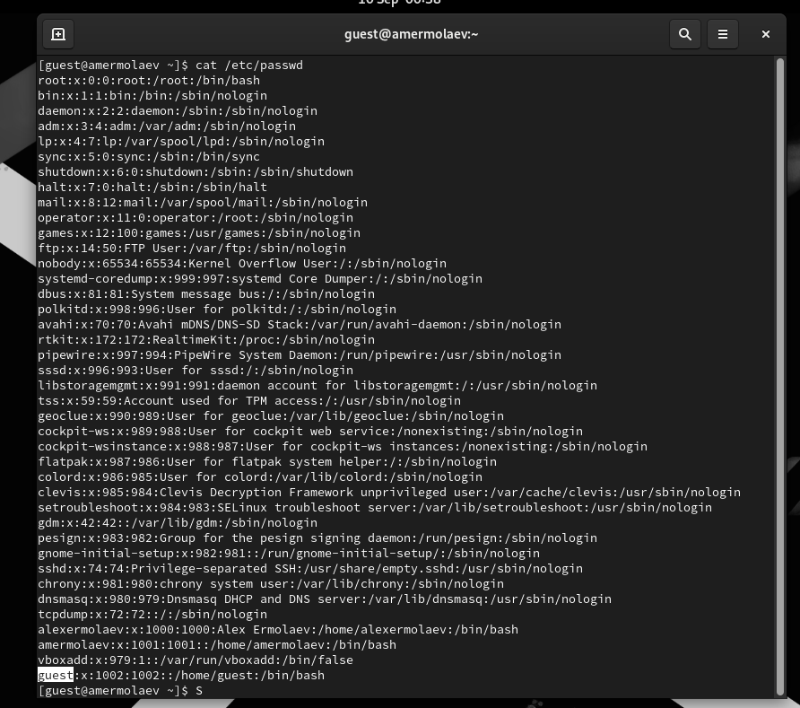
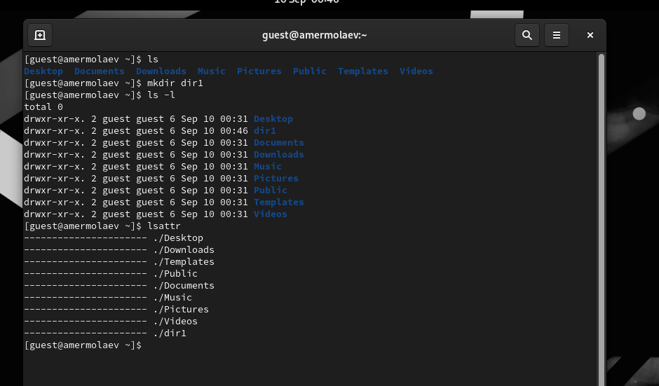
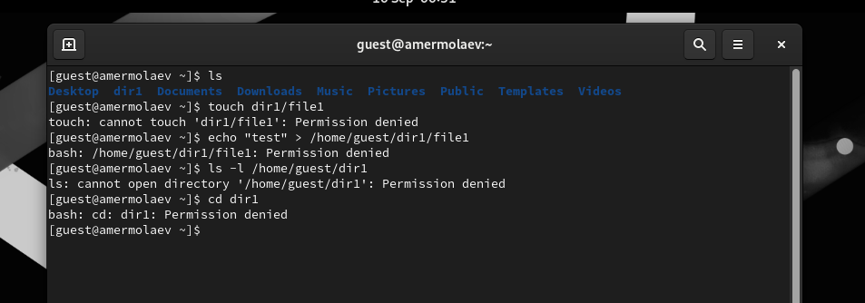
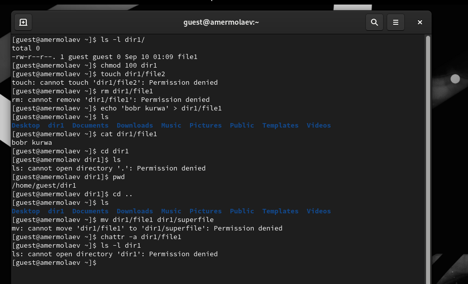

---
## Front matter
lang: ru-RU
title: Презентация к лабораторной работе №2
author: Ермолаев А.М.
group: НПМбд-01-21

## Formatting
toc: false
slide_level: 2
theme: metropolis
header-includes: 
 - \metroset{progressbar=frametitle,sectionpage=progressbar,numbering=fraction}
 - '\makeatletter'
 - '\beamer@ignorenonframefalse'
 - '\makeatother'
aspectratio: 43
section-titles: true
---

# Презентация к лабораторной работе №2

# Цель работы

Цель работы: получить практический навык работы в консоли с атрибутами файлов, закрепить теоретические основы дискреционного разграничения доступа в современных системах с открытым кодом на базе ОС Linux.

# Выполнение работы

## Создание пользователя

## Вход в систему под новым пользователем

## Просмотр инофрмации о домашней директории  

## Просмотр информации о пользователе

## Просмотр существующих директорий

## Права доступа к созданной папке (по умолчанию и при изменении прав доступа)

## Заполнение таблиц «Установленные права и разрешённые действия» и «Минимально необходимые права для выполнения операций внутри директории»

# Вывод
## В рамках выполнения работы я получил практический навык работы в консоли с атрибутами файлов, закрепил теоретические основы дискреционного разграничения доступа в современных системах с открытым кодом на базе ОС Linux.

# Финал

