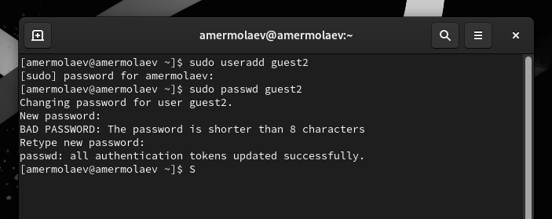
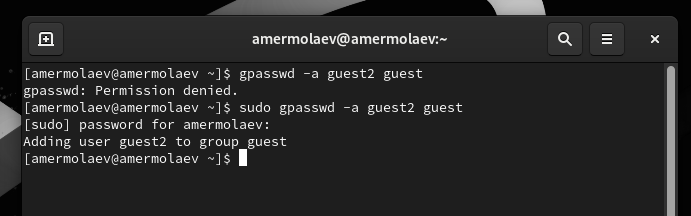
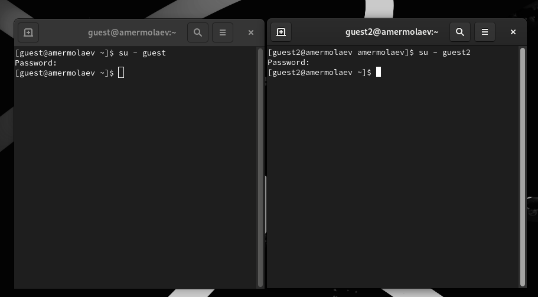
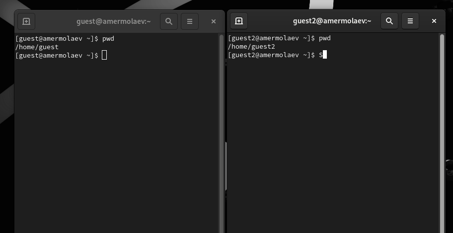
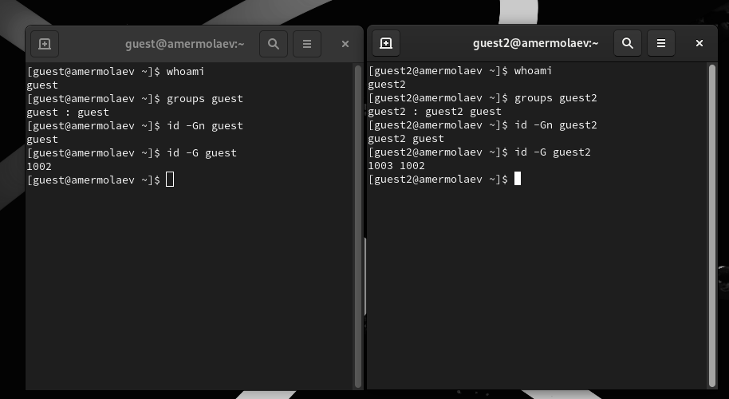
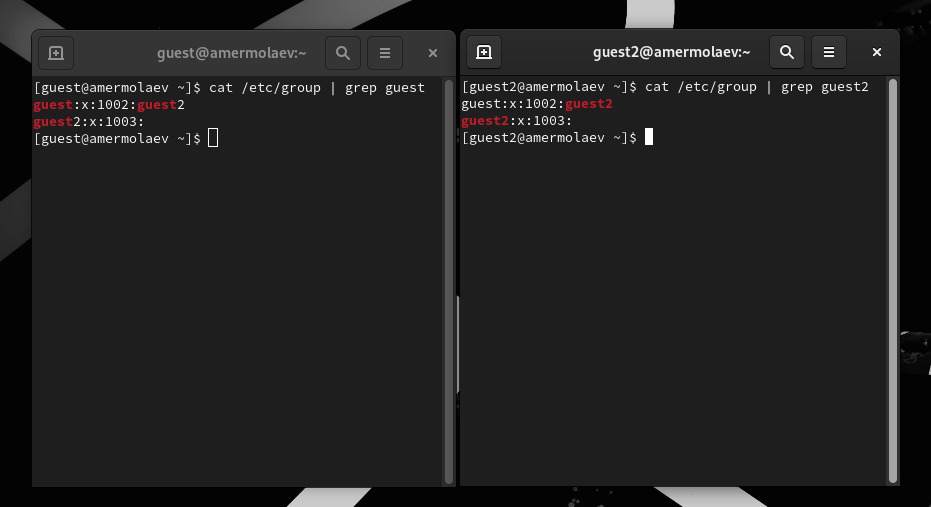
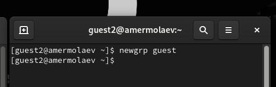
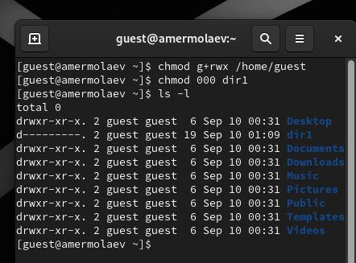
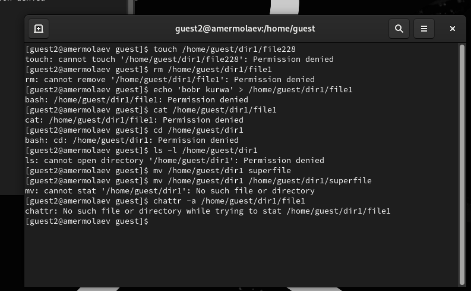

---
## Front matter
lang: ru-RU
title: Презентация к лабораторной работе №3
author: Ермолаев А.М.
group: НПМбд-02-21

## Formatting
toc: false
slide_level: 2
theme: metropolis
header-includes: 
 - \metroset{progressbar=frametitle,sectionpage=progressbar,numbering=fraction}
 - '\makeatletter'
 - '\beamer@ignorenonframefalse'
 - '\makeatother'
aspectratio: 43
section-titles: true
---

# Презентация к лабораторной работе №3

# Цель работы

Цель работы: получить практический навык работы в консоли с атрибутами файлов для групп пользователей.

# Выполнение работы

## Создание пользователей

## Добавление пользователя в группу 

## Вход в систему от двух пользователей 

## Просмотр пути до текущей директории  

## Команды groups и id

## Файл /etc/group

## Регистрация пользователя в группе

## Заполнение таблиц

# Вывод
## В рамках выполнения работы я получил практический навык работы в консоли с атрибутами файлов для групп пользователей.

# Финал

