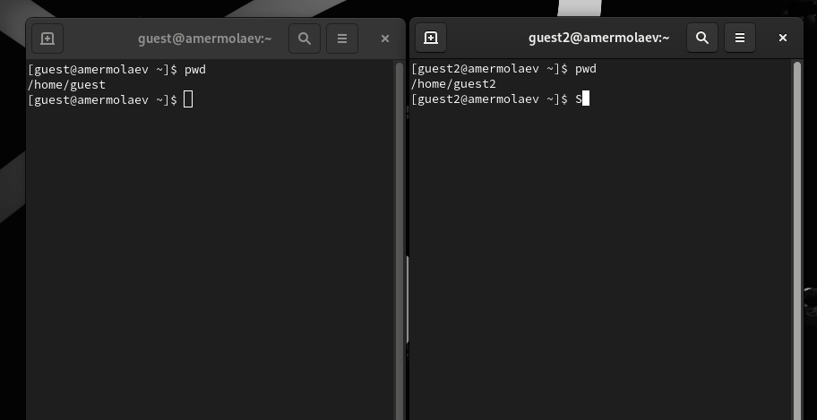
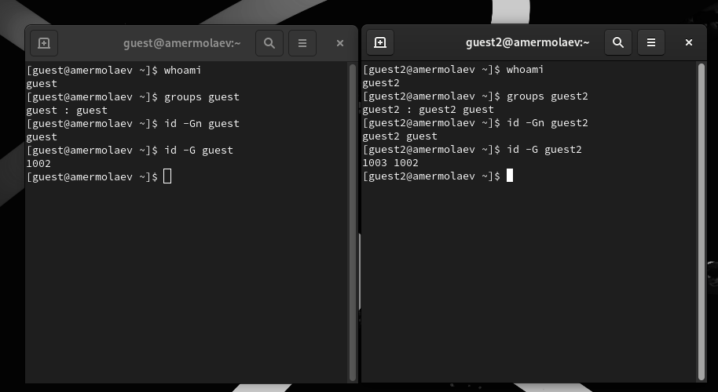
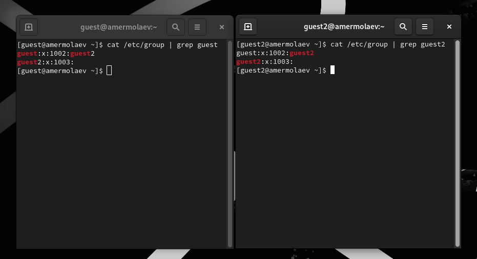
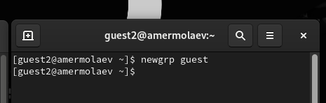
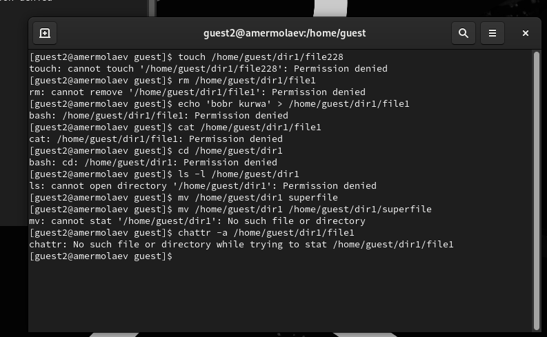

# **Отчет к лабораторной работе №3**
## **Common information**
discipline: Основы информационной безопасности 
group: НПМбд-02-21  
author: Ермолаев А.М.
---
---
## **Цель работы**

Получить практический навык работы в консоли с атрибутами файлов для групп пользователей.

## **Выполнение работы**

В установленной операционной системе ОС Rocky Linux создадим учётные записи пользователей guest и guest2. Так как пользователя guest мы создавали в рамках выполнения предыдущей работы, огранчимся созданием пользователя guest2:


Добавим пользователя guest2 в группу guest командой

```
sudo gpasswd -a guest2 guest
```


Осуществим вход в систему от двух пользователей на двух разных консолях. 


Для обоих пользователей командой

```
pwd
```
определим директорию, в которой они находитятся:



Уточним имя пользователей, их группы, кто в них входит и к каким группам принадлежит они сами. Определим командами
```
groups guest
```
 и
```
groups guest2
```
в какие группы входят пользователи guest и
guest2. Сравним вывод команды groups с выводом команд id -Gn и id -G:



Как видно, вывод совпадает с ожидаемым.

Сравним полученную информацию с содержимым файла /etc/group командой

```
cat /etc/group
```



От имени пользователя guest2 выполним регистрацию пользователя guest2 в группе guest командой
```
newgrp guest
```



От имени пользователя guest изменим права директории /home/guest, разрешив все действия для пользователей группы:
```
chmod g+rwx /home/guest
```
От имени пользователя guest снимем с директории /home/guest/dir1
все атрибуты командой
```
chmod 000 dirl
```
Проверим правильность снятия атрибутов:


Начнем заполнение таблицы 3.1, меняя атрибуты у директории dir1 и файла file1 от имени пользователя guest и делая проверку от пользователя guest2, определяя опытным путём, какие операции разрешены, а какие нет.
Проиллюстрируем проверку для первой строки таблицы:  



В итоге, получилась следующая таблица

|директория|файл|оп. 1|оп. 2|оп. 3|оп. 4|оп. 5|оп. 6|оп. 7|оп. 8|
|----------|----|-----|-----|-----|-----|-----|-----|-----|-----|
|    000   |000 |  -  |  -  |  -  |  -  |  -  |  -  |  -  |  -  |
|    010   |000 |  -  |  -  |  -  |  -  |  +  |  -  |  -  |  -  |
|    020   |000 |  -  |  -  |  -  |  -  |  -  |  -  |  -  |  -  |
|    030   |000 |  +  |  +  |  -  |  -  |  +  |  -  |  +  |  -  |
|    040   |000 |  -  |  -  |  -  |  -  |  -  |  +  |  -  |  -  |
|    050   |000 |  -  |  -  |  -  |  -  |  +  |  +  |  -  |  -  |
|    060   |000 |  -  |  -  |  -  |  -  |  -  |  +  |  -  |  -  |
|    070   |000 |  +  |  +  |  -  |  -  |  +  |  +  |  +  |  -  |
|    000   |100 |  -  |  -  |  -  |  -  |  -  |  -  |  -  |  -  |
|----------|----|-----|-----|-----|-----|-----|-----|-----|-----|
|    000   |010 |  -  |  -  |  -  |  -  |  +  |  -  |  -  |  -  |
|    010   |010 |  -  |  -  |  -  |  -  |  -  |  -  |  -  |  -  |
|    020   |010 |  -  |  -  |  -  |  -  |  -  |  -  |  -  |  -  |
|    030   |010 |  +  |  +  |  -  |  -  |  +  |  -  |  +  |  -  |
|    040   |010 |  -  |  -  |  -  |  -  |  -  |  +  |  -  |  -  |
|    050   |010 |  -  |  -  |  -  |  -  |  +  |  +  |  -  |  -  |
|    060   |010 |  -  |  -  |  -  |  -  |  -  |  +  |  -  |  -  |
|    070   |010 |  +  |  +  |  -  |  -  |  +  |  +  |  +  |  -  |
|----------|----|-----|-----|-----|-----|-----|-----|-----|-----|
|    000   |020 |  -  |  -  |  -  |  -  |  -  |  -  |  -  |  -  |
|    010   |020 |  -  |  -  |  +  |  -  |  +  |  -  |  -  |  -  |
|    020   |020 |  -  |  -  |  -  |  -  |  -  |  -  |  -  |  -  |
|    030   |020 |  +  |  +  |  +  |  -  |  +  |  -  |  +  |  -  |
|    040   |020 |  -  |  -  |  -  |  -  |  -  |  +  |  -  |  -  |
|    050   |020 |  -  |  -  |  +  |  -  |  +  |  +  |  -  |  -  |
|    060   |020 |  -  |  -  |  -  |  -  |  -  |  +  |  -  |  -  |
|    070   |020 |  +  |  +  |  +  |  -  |  +  |  +  |  +  |  -  |
|----------|----|-----|-----|-----|-----|-----|-----|-----|-----|
|    000   |030 |  -  |  -  |  -  |  -  |  -  |  -  |  -  |  -  |
|    010   |030 |  -  |  -  |  +  |  -  |  +  |  -  |  -  |  -  |
|    020   |030 |  -  |  -  |  -  |  -  |  -  |  -  |  -  |  -  |
|    030   |030 |  +  |  +  |  -  |  +  |  +  |  -  |  +  |  -  |
|    040   |030 |  -  |  -  |  -  |  -  |  -  |  +  |  -  |  -  |
|    050   |030 |  -  |  -  |  +  |  -  |  +  |  +  |  -  |  -  |
|    060   |030 |  -  |  -  |  -  |  -  |  -  |  +  |  -  |  -  |
|    070   |030 |  +  |  +  |  +  |  -  |  +  |  +  |  +  |  -  |
|----------|----|-----|-----|-----|-----|-----|-----|-----|-----|
|    000   |040 |  -  |  -  |  -  |  -  |  -  |  -  |  -  |  -  |
|    010   |040 |  -  |  -  |  -  |  +  |  +  |  -  |  -  |  -  |
|    020   |040 |  -  |  -  |  -  |  -  |  -  |  -  |  -  |  -  |
|    030   |040 |  +  |  +  |  -  |  +  |  +  |  -  |  +  |  -  |
|    040   |040 |  -  |  -  |  -  |  -  |  -  |  +  |  -  |  -  |
|    050   |040 |  -  |  -  |  -  |  +  |  +  |  +  |  -  |  -  |
|    060   |040 |  -  |  -  |  -  |  -  |  -  |  +  |  -  |  -  |
|    070   |040 |  +  |  +  |  -  |  +  |  +  |  +  |  +  |  -  |
|----------|----|-----|-----|-----|-----|-----|-----|-----|-----|
|    000   |050 |  -  |  -  |  -  |  -  |  -  |  -  |  -  |  -  |
|    010   |050 |  -  |  -  |  -  |  +  |  +  |  -  |  -  |  -  |
|    020   |050 |  -  |  -  |  -  |  -  |  -  |  -  |  -  |  -  |
|    030   |050 |  +  |  +  |  -  |  +  |  +  |  -  |  +  |  -  |
|    040   |050 |  -  |  -  |  -  |  -  |  -  |  +  |  -  |  -  |
|    050   |050 |  -  |  -  |  -  |  +  |  +  |  +  |  -  |  -  |
|    060   |050 |  -  |  -  |  -  |  -  |  -  |  +  |  -  |  -  |
|    070   |050 |  +  |  +  |  -  |  +  |  +  |  +  |  +  |  -  |
|----------|----|-----|-----|-----|-----|-----|-----|-----|-----|
|    000   |060 |  -  |  -  |  -  |  -  |  -  |  -  |  -  |  -  |
|    010   |060 |  -  |  -  |  +  |  +  |  +  |  -  |  -  |  -  |
|    020   |060 |  -  |  -  |  -  |  -  |  -  |  -  |  -  |  -  |
|    030   |060 |  +  |  +  |  +  |  +  |  +  |  -  |  +  |  -  |
|    040   |060 |  -  |  -  |  -  |  -  |  -  |  +  |  -  |  -  |
|    050   |060 |  -  |  -  |  +  |  +  |  +  |  +  |  -  |  -  |
|    060   |060 |  -  |  -  |  -  |  -  |  -  |  +  |  -  |  -  |
|    070   |060 |  +  |  +  |  +  |  +  |  +  |  +  |  +  |  -  |
|----------|----|-----|-----|-----|-----|-----|-----|-----|-----|
|    000   |070 |  -  |  -  |  -  |  -  |  -  |  -  |  -  |  -  |
|    010   |070 |  -  |  -  |  +  |  +  |  +  |  -  |  -  |  -  |
|    020   |070 |  -  |  -  |  -  |  -  |  -  |  -  |  -  |  -  |
|    030   |070 |  +  |  +  |  +  |  +  |  +  |  -  |  +  |  -  |
|    040   |070 |  -  |  -  |  -  |  -  |  -  |  +  |  -  |  -  |
|    050   |070 |  -  |  -  |  +  |  +  |  +  |  +  |  -  |  -  |
|    060   |070 |  -  |  -  |  -  |  -  |  -  |  +  |  -  |  -  |
|    070   |070 |  +  |  +  |  +  |  +  |  +  |  +  |  +  |  -  |
|----------|----|-----|-----|-----|-----|-----|-----|-----|-----|

где
* директория - права доступа директории
* файл - права доступа файла
* оп. 1 - создание файла
* оп. 2 - удаление файла
* оп. 3 - запись в файл
* оп. 4 - чтение файла
* оп. 5 - смена директории
* оп. 6 - просмотр файлов в директории
* оп. 7 - переименование файла
* оп. 8 - смена атрибутов файла

Теперь на основе таблицы выше мы можем заполнить таблицу «Минимальные права для совершения операций от имени пользователей входящих в группу»:

|Операция|Директория мин. права|Файл мин. права|
|--------|---------------------|---------------|
|оп. 1   |030                  |000            |
|оп. 2   |030                  |000            |
|оп. 3   |010                  |040            |
|оп. 4   |010                  |020            |
|оп. 5   |030                  |000            |
|оп. 6   |030                  |000            |
|оп. 7   |030                  |000            |
|--------|---------------------|---------------|

где
* оп. 1 - создание файла
* оп. 2 - удаление файла
* оп. 3 - чтение файла
* оп. 4 - запись в файл
* оп. 5 - переименование файла
* оп. 6 - создание поддиректории
* оп. 7 - удаление поддиректории

## **Вывод**
В рамках выполнения работы я получил практический навык работы в консоли с атрибутами файлов для групп пользователей.

## **Список литературы**
* https://rockylinux.org/
* https://losst.pro/gruppy-polzovatelej-linux
* https://manpages.ubuntu.com/manpages/xenial/ru/man1/newgrp.1.html


