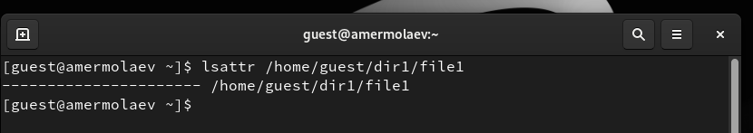
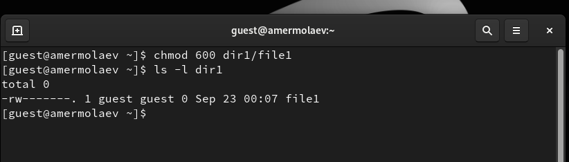
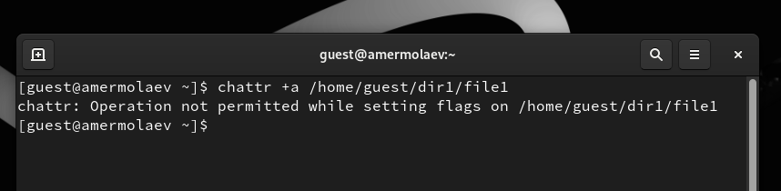
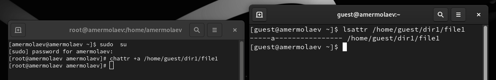
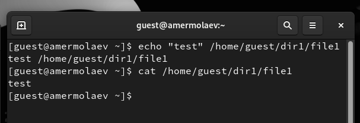
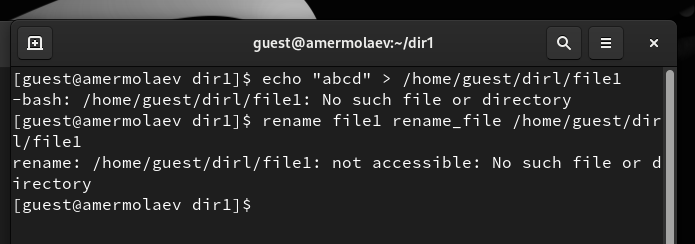
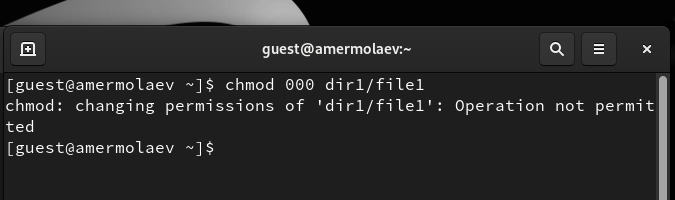
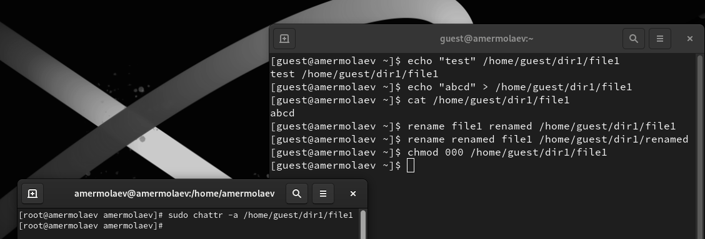
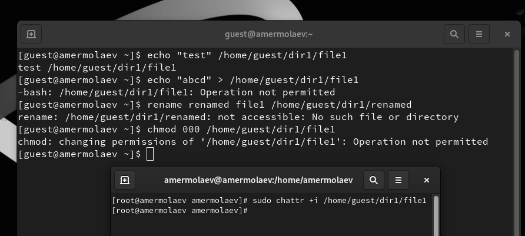

---
## Front matter
lang: ru-RU
title: Презентация к лабораторной работе №4
author: Ермолаев А.М.
group: НПМбд-01-21

## Formatting
toc: false
slide_level: 2
theme: metropolis
header-includes: 
 - \metroset{progressbar=frametitle,sectionpage=progressbar,numbering=fraction}
 - '\makeatletter'
 - '\beamer@ignorenonframefalse'
 - '\makeatother'
aspectratio: 43
section-titles: true
---

# Презентация к лабораторной работе №4

## **Цель работы**

Цель работы: получить практический навык работы в консоли с расширенными атрибутами файлов.

# Выполнение работы

##  Определение расширенных атрибутов файла /home/guest/dir1/file1

## Изменение прав доступа, разрешающие чтение и запись

## Установление расширенных атрибутов файла  

## Установка расширенных атрибутов файла и их проверка  

## Попытка дозаписи файла

## Попытка перезаписи и переименования файла

## Попытка изменения прав доступа файла

## Снятие расширенных атрибутов файла и повторение операций

## Повторение операций при других праваx доступа

# Вывод
## В рамках выполнения работы я получил практический навык работы в консоли с  расширенными атрибутами файлов.

# Финал

