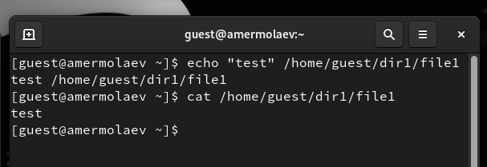
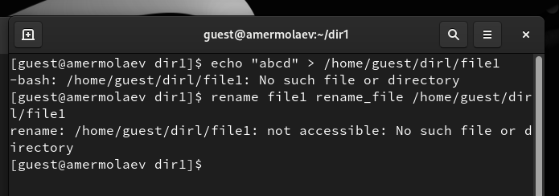
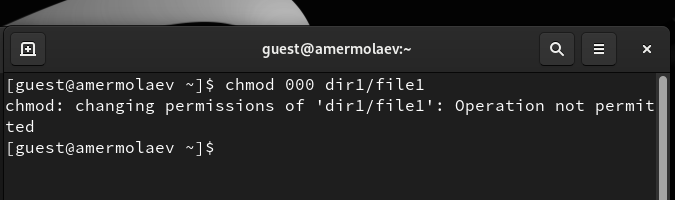

# **Отчет к лабораторной работе №4**
## **Common information**
discipline: Основы информационной безопасности 
group: НПМбд-02-21  
author: Ермолаев А.М.
---
---
## **Цель работы**

Получить практический навык работы в консоли с расширенными
атрибутами файлов.

## **Выполнение работы**

От имени пользователя guest определите расширенные атрибуты файла /home/guest/dir1/file1 командой

```
lsattr /home/guest/dir1/file1
```


Установим командой

```
chmod 600 file1
```

на файл file1 права, разрешающие чтение и запись для владельца файла:


Попробуем установить на файл /home/guest/dir1/file1 расширенный атрибут a от имени пользователя guest:

```
chattr +a /home/guest/dir1/file1
```


В ответ мы получили отказ выполнения операции.

Повысив свои права с помощью команды su, попробуем установить расширенный атрибут a на файл /home/guest/dir1/file1:

```
chattr +a /home/guest/dir1/file1
```

От пользователя guest проверим правильность установления атрибута:

```
lsattr /home/guest/dir1/file1
```


Выполним дозапись в файл file1 слова «test» командой

```
echo "test" /home/guest/dir1/file1
```

После этого выполним чтение файла file1 командой

```
cat /home/guest/dir1/file1
```



Попробуем удалить файл file1 либо стереть имеющуюся в нём информацию командой

```
echo "abcd" > /home/guest/dirl/file1
```

Попробуем переименовать файл:




Попробуем с помощью команды
```
chmod 000 file1
```
установить на файл file1 права, например, запрещающие чтение и запись для владельца файла. 



Как видно, при выполнении вышеупомянутых команд нам было отказано в доступе.

Снимим расширенный атрибут a с файла /home/guest/dirl/file1 от
имени суперпользователя командой

```
chattr -a /home/guest/dir1/file1
```

Повторим операции, которые вам ранее не удавалось выполнить:


Как видно, все операции выполнить удалось.

Наконец, повторим действия по шагам, заменив атрибут «a» атрибутом «i».


Как видно, в большинстве операций нам было отказано.

## **Вывод**
В рамках выполнения работы я получил практический навык работы в консоли с  расширенными атрибутами файлов.


## **Список литературы**
* https://rockylinux.org/
* https://linux-faq.ru/page/komanda-lsattr
* https://losst.pro/neizmenyaemye-fajly-v-linux
* https://wiki.astralinux.ru/pages/viewpage.action?pageId=149063848


