---
## Front matter
lang: ru-RU
title: Презентация к лабораторной работе №4
author: Ермолаев А.М.
group: НПМбд-01-21

## Formatting
toc: false
slide_level: 2
theme: metropolis
header-includes: 
 - \metroset{progressbar=frametitle,sectionpage=progressbar,numbering=fraction}
 - '\makeatletter'
 - '\beamer@ignorenonframefalse'
 - '\makeatother'
aspectratio: 43
section-titles: true
marp: true
backgroundColor: #16c9e0

---

# Презентация к лабораторной работе №5

---

# Цель работы

* Изучить механизмы изменения идентификаторов, применения SetUID- и Sticky-битов. 
* Получить практический навык работы в консоли с дополнительными атрибутами. 
* Рассмотреть работу механизма смены идентификатора процессов пользователей, а также влияние бита Sticky на запись и удаление файлов.

---

# Выполнение работы

---

## Вход под пользователем guest

---

## Программа simpleid.c

---

## Компиляция, выполнение и команда id 

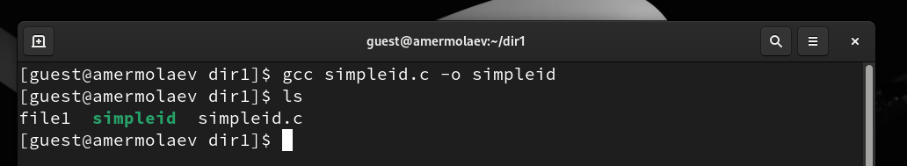

---

## Программа simpleid2.c  

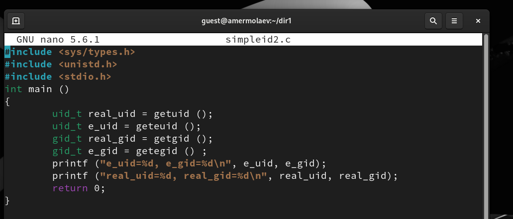

---

## Компиляция и запуск программы

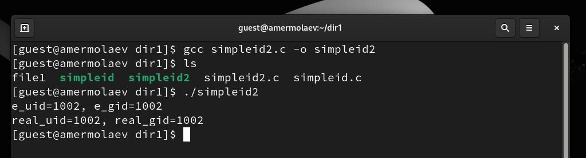

---

## Изменение прав доступа и запуск программы

---

## Добавление SetGID-бита

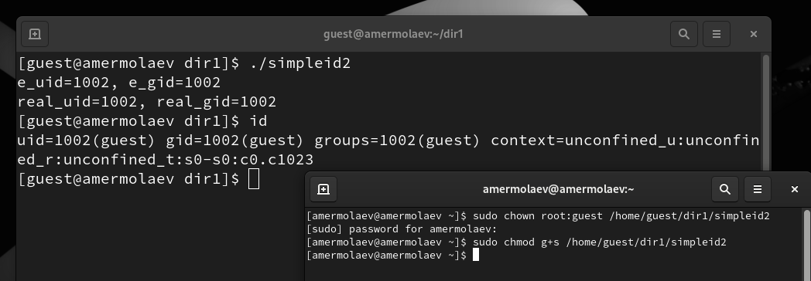

---

## Программа readfile.c

---

## Компиляция

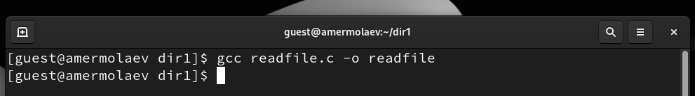

---

## Изменение прав доступа

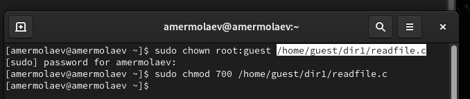

---

## Добавление SetUID-бита

---

## Чтение файлов

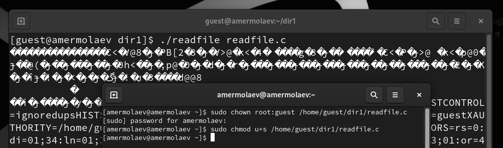

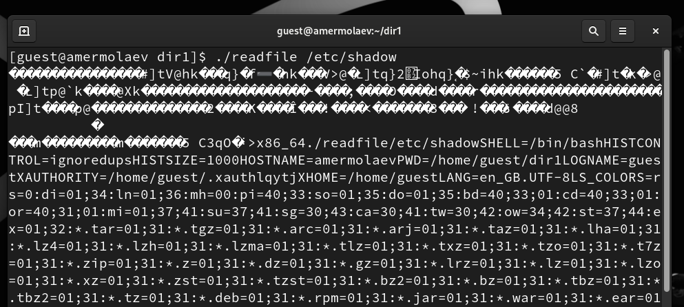

---

## Sticky-бит

---

## Файл file01.txt

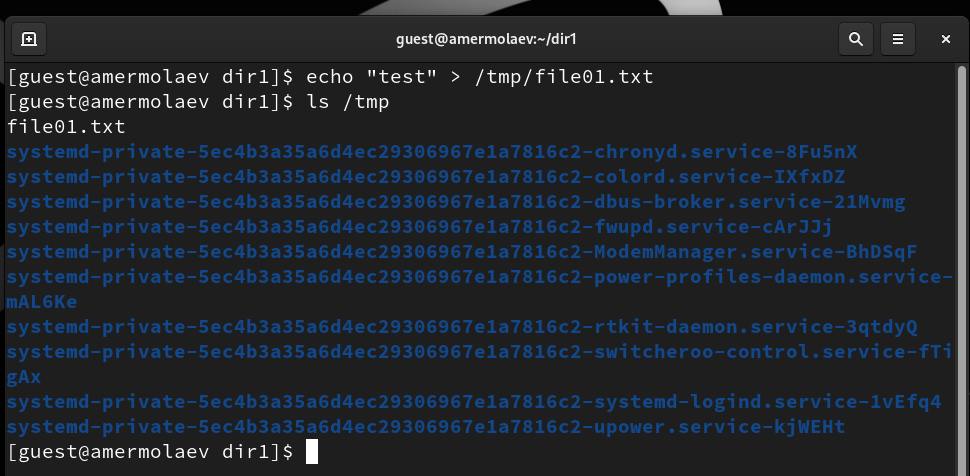

---

## Предоставление прав доступа

---

## Другие операции с файлом

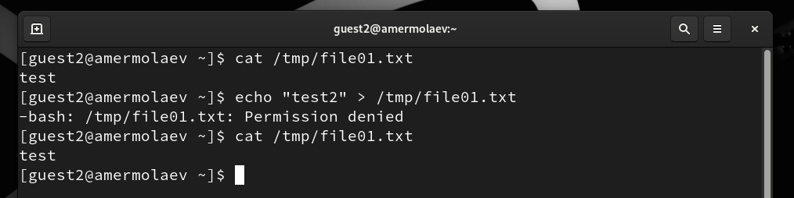

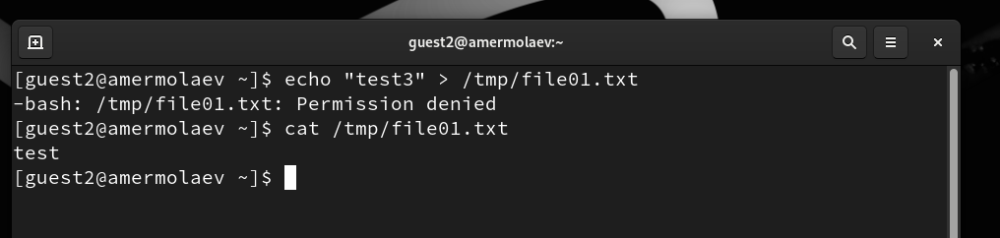

---

## Другие операции с файлом

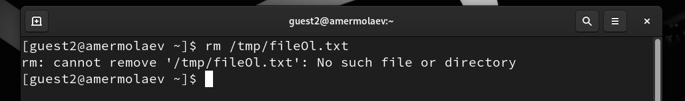

---

## Снятие Sticky-бита

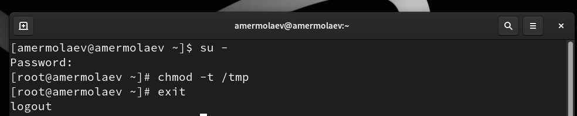

---

## Повторение команд

---

## Возвращение Sticky-бита

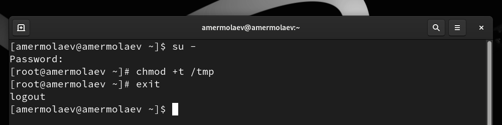

---

# Вывод

В рамках выполнения работы я 

* Изучил механизмы изменения идентификаторов, применения SetUID- и Sticky-битов. 
* Получил практический навык работы в консоли с дополнительными атрибутами. 
* Рассмотрел работу механизма смены идентификатора процессов пользователей, а также влияние бита Sticky на запись и удаление файлов.

---

# Финал
