# **Отчет к лабораторной работе №5**
## **Common information**
discipline: Основы информационной безопасности 
group: НПМбд-02-21  
author: Ермолаев А.М.

---
## **Цель работы**

* Изучить механизмы изменения идентификаторов, применения SetUID- и Sticky-битов. 
* Получить практический навык работы в консоли с дополнительными атрибутами. 
* Рассмотреть работу механизма смены идентификатора процессов пользователей, а также влияние бита Sticky на запись и удаление файлов.

## **Выполнение работы**

Войдем в систему от имени пользователя guest:

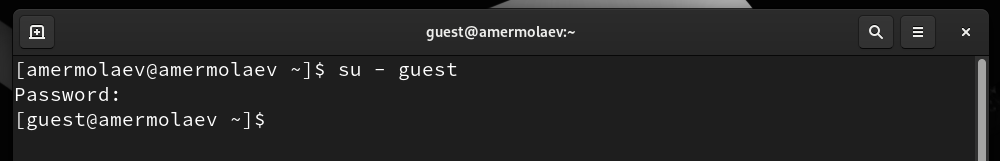

Создадим программу simpleid.c:

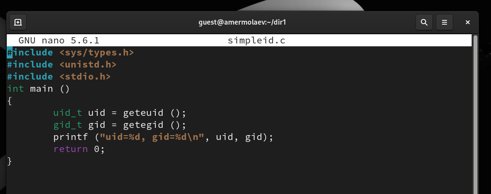

Скомплилируем программу и убедимся, что файл программы создан:

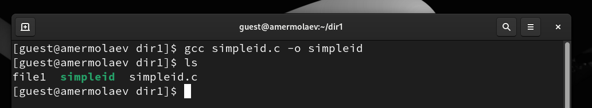

Выполним программу simpleid и системную программу id:

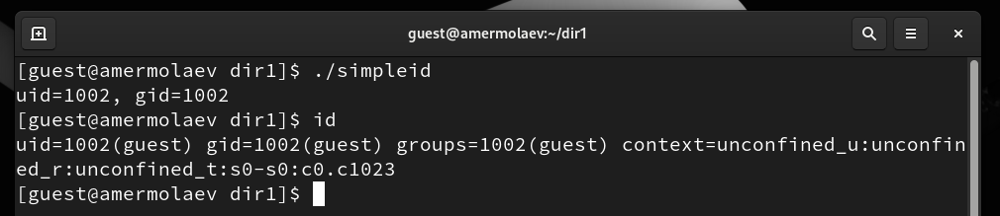

Усложним программу, добавив вывод действительных идентификаторов. Получившуюся программу назовем simpleid2.c:

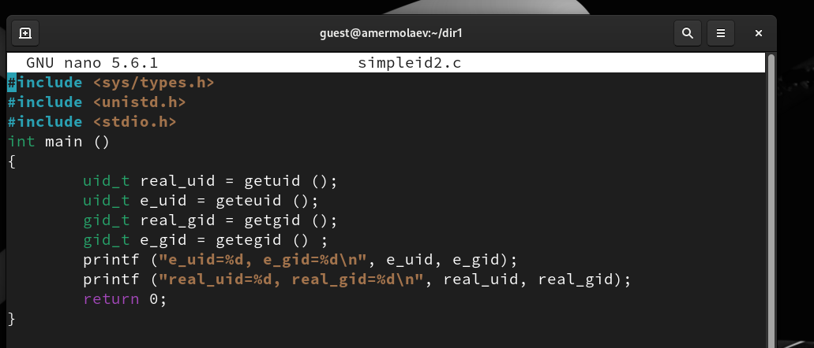

Скомпилируем и запустим simpleid2.c:

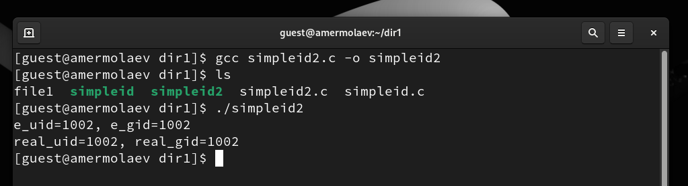

От имени суперпользователя выполним команды:

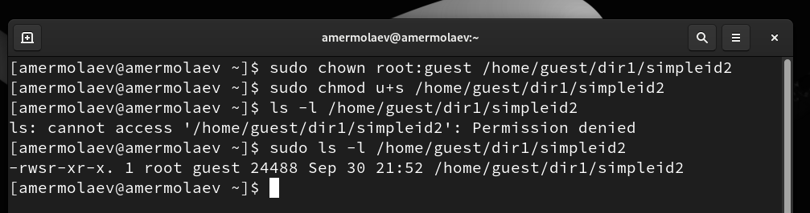

Запустим simpleid2 и id:

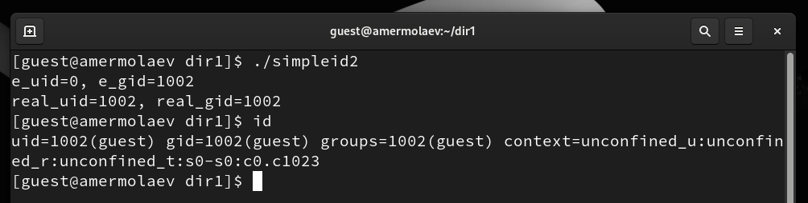

Проделаем тоже самое относительно SetGID-бита:

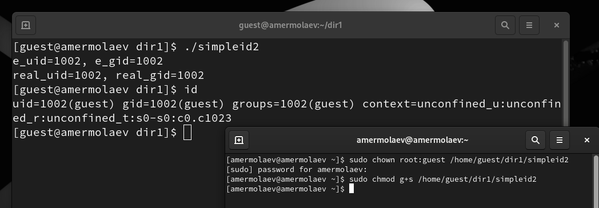

Создадим программу readfile.c:

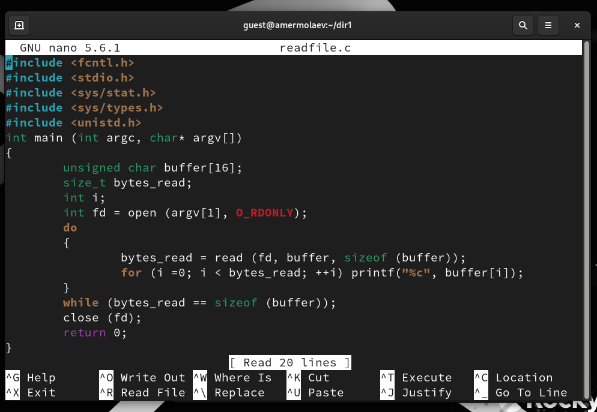

Cкомпилируем её:

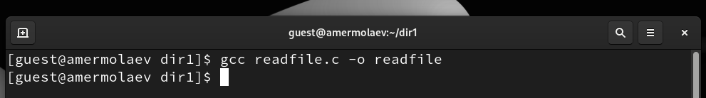

Сменим владельца у файла readfile.c (или любого другого текстового файла в системе) и измените права так, чтобы только суперпользователь (root) мог прочитать его, a guest не мог:

Проверим, что пользователь guest не может прочитать файл readfile.c.
Сменим у программы readfile владельца и установим SetU’D-бит:

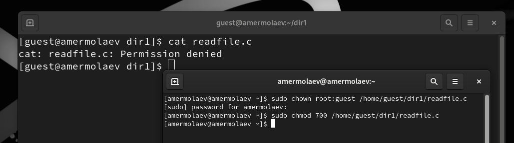

Проверим, может ли программа readfile прочитать файл readfile.c:

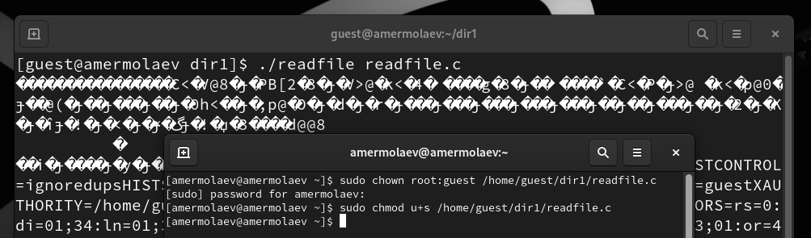

Проверим, может ли программа readfile прочитать файл /etc/shadow:

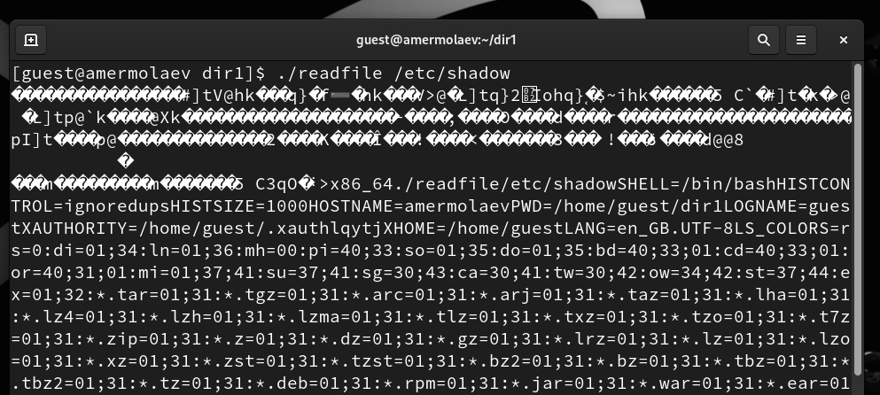

Выясним, установлен ли атрибут Sticky на директории /tmp:

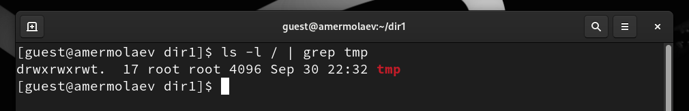

От имени пользователя guest создадим файл file01.txt в директории /tmp со словом test:

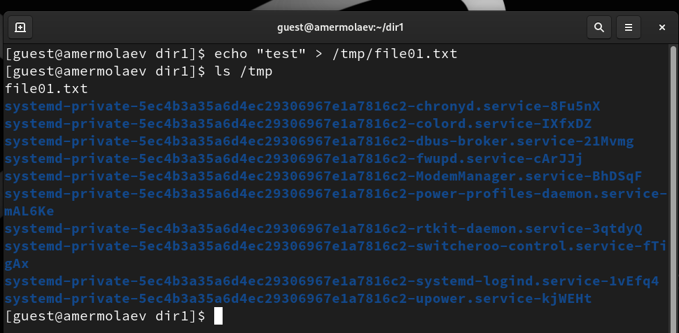

Просмотрим атрибуты у только что созданного файла и разрешим чтение и запись для категории пользователей «все остальные»:

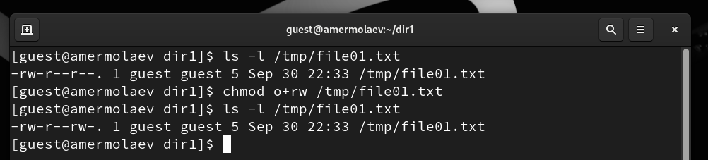

От пользователя guest2 (не являющегося владельцем) попробуем прочитать файл /tmp/file01.txt, а также дозаписать в файл слово test2:

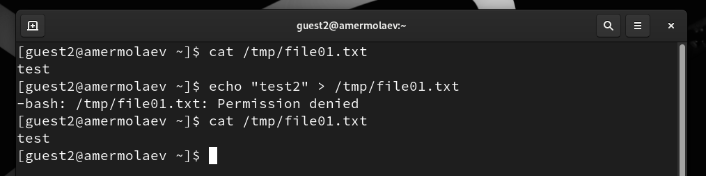

Также попробуем записать в файл /tmp/file01.txt
слово test3, стерев при этом всю имеющуюся в файле информацию:

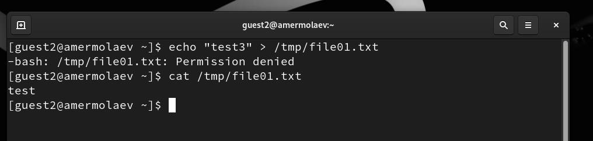

От пользователя guest2 попробуем удалить файл /tmp/file01.txt:

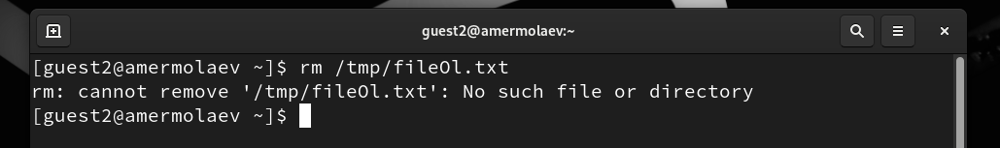

Повысим свои права до суперпользователя и выполним после этого команду, снимающую атрибут t (Sticky-бит) с директории /tmp:

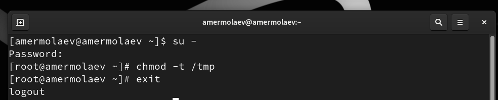

От пользователя guest2 проверим, что атрибута t у директории /tmp нет:

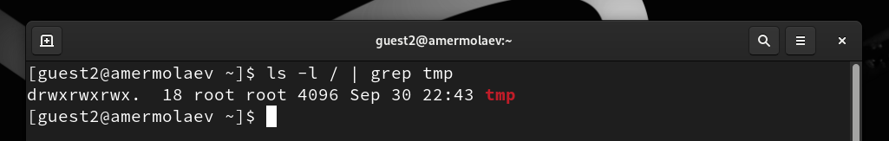

Повторим предыдущие шаги:

Повысим свои права до суперпользователя и верните атрибут t на директорию /tmp:

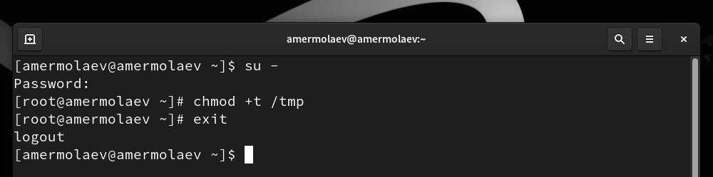

## **Вывод**
В рамках выполнения работы я 

* Изучил механизмы изменения идентификаторов, применения SetUID- и Sticky-битов. 
* Получил практический навык работы в консоли с дополнительными атрибутами. 
* Рассмотрел работу механизма смены идентификатора процессов пользователей, а также влияние бита Sticky на запись и удаление файлов.

## **Список литературы**
* https://rockylinux.org/
* https://habr.com/ru/articles/469667/
* https://www.golinuxcloud.com/sticky-bit-linux/

