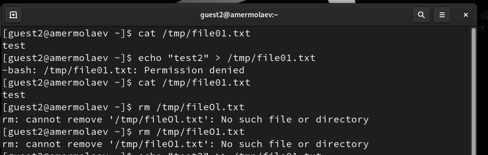

# **Отчет к лабораторной работе №5**
## **Common information**
discipline: Основы информационной безопасности 
group: НПМбд-02-21  
author: Ермолаев А.М.

---
## **Цель работы**

* Изучить механизмы изменения идентификаторов, применения SetUID- и Sticky-битов. 
* Получить практический навык работы в консоли с дополнительными атрибутами. 
* Рассмотреть работу механизма смены идентификатора процессов пользователей, а также влияние бита Sticky на запись и удаление файлов.

## **Выполнение работы**

Войдем в систему от имени пользователя guest:

Создадим программу simpleid.c:

Скомплилируем программу и убедимся, что файл программы создан:

Выполним программу simpleid и системную программу id:

Усложним программу, добавив вывод действительных идентификаторов. Получившуюся программу назовем simpleid2.c:

Скомпилируем и запустим simpleid2.c:

От имени суперпользователя выполним команды:

Запустим simpleid2 и id:

Проделаем тоже самое относительно SetGID-бита:

Создадим программу readfile.c:

Cкомпилируем её:

Сменим владельца у файла readfile.c (или любого другого текстового файла в системе) и измените права так, чтобы только суперпользователь (root) мог прочитать его, a guest не мог:

Проверим, что пользователь guest не может прочитать файл readfile.c.
Сменим у программы readfile владельца и установим SetU’D-бит:

Проверим, может ли программа readfile прочитать файл readfile.c:

Проверим, может ли программа readfile прочитать файл /etc/shadow:

Выясним, установлен ли атрибут Sticky на директории /tmp:

От имени пользователя guest создадим файл file01.txt в директории /tmp со словом test:

Просмотрим атрибуты у только что созданного файла и разрешим чтение и запись для категории пользователей «все остальные»:

От пользователя guest2 (не являющегося владельцем) попробуем прочитать файл /tmp/file01.txt, а также дозаписать в файл слово test2:

Также попробуем записать в файл /tmp/file01.txt
слово test3, стерев при этом всю имеющуюся в файле информацию:

От пользователя guest2 попробуем удалить файл /tmp/file01.txt:

Повысим свои права до суперпользователя и выполним после этого команду, снимающую атрибут t (Sticky-бит) с директории /tmp:

От пользователя guest2 проверим, что атрибута t у директории /tmp нет:

Повторим предыдущие шаги:

Повысим свои права до суперпользователя и верните атрибут t на директорию /tmp:

## **Вывод**
В рамках выполнения работы я 

* Изучил механизмы изменения идентификаторов, применения SetUID- и Sticky-битов. 
* Получил практический навык работы в консоли с дополнительными атрибутами. 
* Рассмотрел работу механизма смены идентификатора процессов пользователей, а также влияние бита Sticky на запись и удаление файлов.

## **Список литературы**
* https://rockylinux.org/
* https://habr.com/ru/articles/469667/
* https://www.golinuxcloud.com/sticky-bit-linux/

