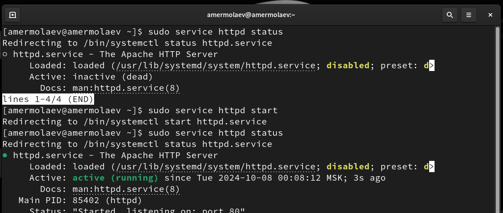
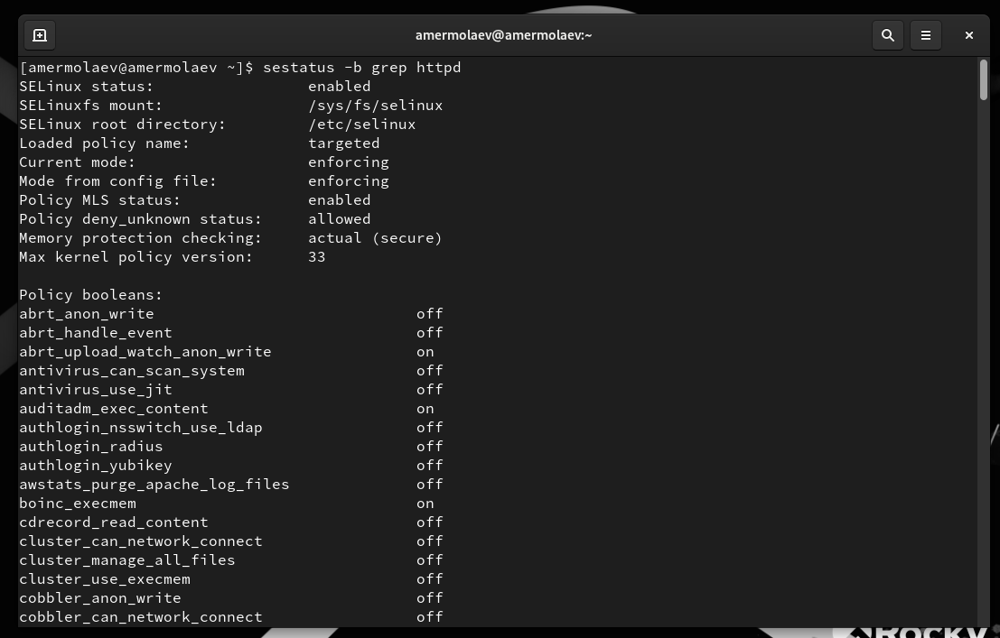
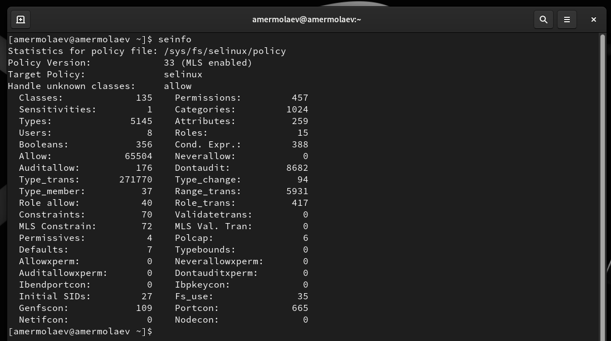
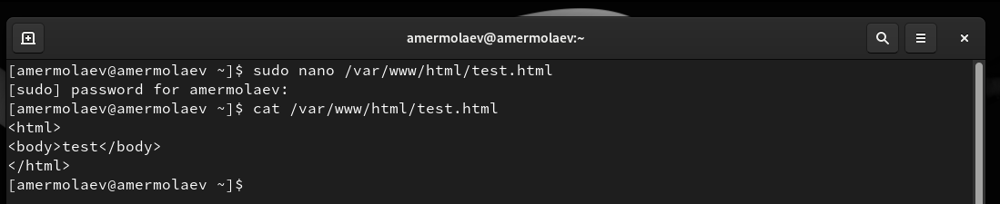
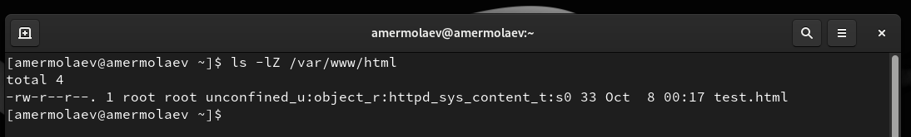
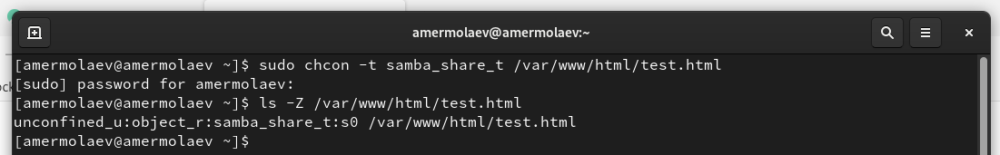
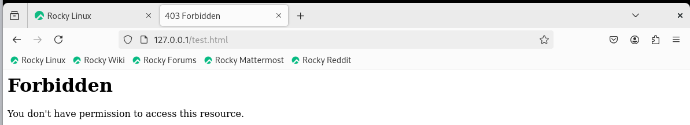
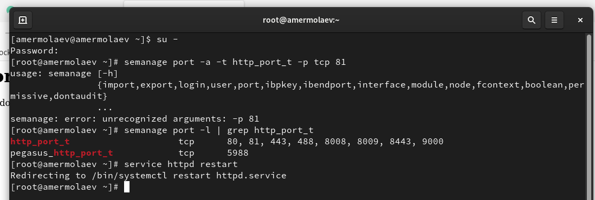
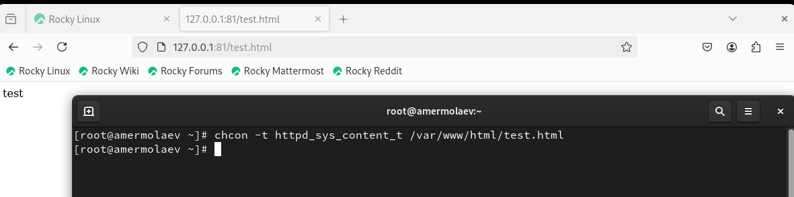

---
## Front matter
lang: ru-RU
title: Презентация к лабораторной работе №6
author: Ермолаев А.М.
group: НПМбд-01-21

## Formatting
toc: false
slide_level: 2
theme: metropolis
header-includes: 
 - \metroset{progressbar=frametitle,sectionpage=progressbar,numbering=fraction}
 - '\makeatletter'
 - '\beamer@ignorenonframefalse'
 - '\makeatother'
aspectratio: 43
section-titles: true
marp: true
backgroundColor: #16c9e0

---

# Презентация к лабораторной работе №6

---

# Цель работы

* Развить навыки администрирования ОС Linux. Получить первое практическое знакомство с технологией SELinux
* Проверить работу SELinx на практике совместно с веб-сервером Apache.

---

# Выполнение работы

---

## Команды getenforce и seastatus

---

## Запуск сервиса Apache2

---

## Контекст безопасности Apache2

---

## Текущее состояние переключателей для Apache2 

---

## Команда seinfo

---

## Тип файлов и поддиректорий

---

## Файл test.html

---

## Контекст файла

---

## Обращение к веб-серверу

---

## Контекст файла

---

## Изменение контекста файла

---

## Потвторное обращение к веб-серверу

---

## Просмотр логов

---

## Изменение прослушиваемого порта

---

## Перезапуск Apache2

---

## Анализ логов

---

## Просмотр доступных портов

---

## Контекст файла

---

## Изменение конфигурационного файла  Apache2

---

## Удаление привязки к порту и файла

---

# Вывод

В рамках выполнения работы я 

* Развил навыки администрирования ОС Linux. Получить первое практическое знакомство с технологией SELinux
* Проверил работу SELinx на практике совместно с веб-сервером Apache.

---

# Финал
