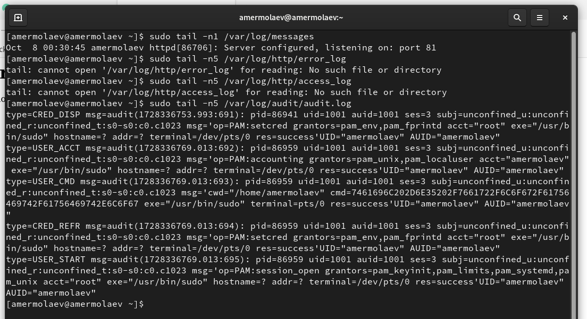

# **Отчет к лабораторной работе №6**
## **Common information**
discipline: Основы информационной безопасности 
group: НПМбд-02-21  
author: Ермолаев А.М.

---
## **Цель работы**

* Развить навыки администрирования ОС Linux. Получить первое практическое знакомство с технологией SELinux
* Проверить работу SELinx на практике совместно с веб-сервером Apache.

## **Выполнение работы**

Войдем в систему с полученными учётными данными и убедимся, что SELinux работает в режиме enforcing политики targeted с помощью команд ```getenforce``` и ```sestatus```.


Обратим с помощью браузера к веб-серверу, запущенному на вашем компьютере, и убедимся, что последний работает (в нашем случае его надо предварительно запустить):


Найдем веб-сервер Apache в списке процессов, определим его контекст безопасности:


Посмотрим текущее состояние переключателей SELinux для Apache:


Посмотрим статистику по политике с помощью команды ```seinfo```, также определим множество пользователей, ролей, типов:


Определим типы файлов и поддиректорий, находящихся в директории /var/www,  /var/www/html, а также круг пользователей, которым разрешено создание файлов в
директории /var/www/html:


Создадим от имени суперпользователя html-файл
/var/www/html/test.html:


Проверим контекст созданного файла:


Обратимся к файлу через веб-сервер, введя в браузере адрес
```http://127.0.0.1/test.html```:


Изучим справку man httpd_selinux. Проверим контекст файла:


Изменим контекст файла /var/www/html/test.html с
httpd_sys_content_t на любой другой, к которому процесс httpd не должен иметь доступа, например, на samba_share_t:


Попробуем ещё раз получить доступ к файлу через веб-сервер, введя в браузере адрес ```http://127.0.0.1/test.html```:


Просмотрим log-файлы веб-сервера Apache и системный лог-файл:


Попробуем запустить веб-сервер Apache на прослушивание ТСР-порта
81 Для
этого в файле /etc/httpd/httpd.conf найдем строчку Listen 80 и
заменим её на Listen 81:


Выполним перезапуск веб-сервера Apache:


Проанализируем лог-файлы:



Выполним команду
```
semanage port -a -t http_port_t -р tcp 81
```
После этого проверим список портов командой
```
semanage port -l | grep http_port_t
```

После чего попробуем запустить веб-сервер Apache ещё раз:


Вернем контекст httpd_sys_cоntent__t к файлу /var/www/html/ test.html:


Исправим конфигурационный файл apache, вернув Listen 80.


Удалим привязку http_port_t к 81 порту. Затем удалим файл /var/www/html/test.html:


## **Вывод**
В рамках выполнения работы я 

* Развил навыки администрирования ОС Linux. Получить первое практическое знакомство с технологией SELinux
* Проверил работу SELinx на практике совместно с веб-сервером Apache.

## **Список литературы**
* https://rockylinux.org/
* https://habr.com/ru/articles/469667/
* https://www.linuxteck.com/how-to-install-apache-on-rocky-linux/
* https://habr.com/ru/companies/kingservers/articles/209644/


