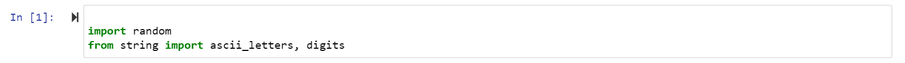
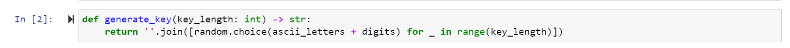
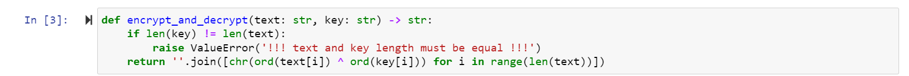
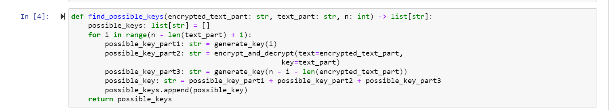
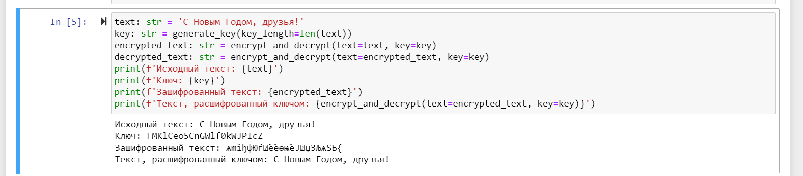
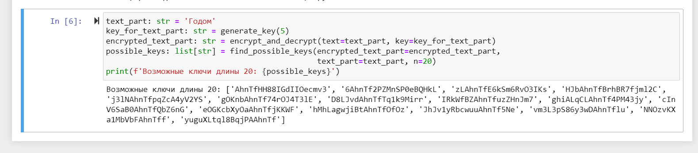

---
## Front matter
lang: ru-RU
title: Презентация к лабораторной работе №7
author: Ермолаев А.М.
group: НПМбд-01-21

## Formatting
toc: false
slide_level: 2
theme: metropolis
header-includes: 
 - \metroset{progressbar=frametitle,sectionpage=progressbar,numbering=fraction}
 - '\makeatletter'
 - '\beamer@ignorenonframefalse'
 - '\makeatother'
aspectratio: 43
section-titles: true
marp: true
backgroundColor: #16c9e0

---

# Презентация к лабораторной работе №7

---

# Цель работы

Освоить на практике применение режима однократного гаммирования.

---

# Выполнение работы

---

## Импорт библиотек / функция для генерации случайного ключа

---

## Функция шифрования и дешифрования / функция find_possible_keys

---

## Проверка корректности работы функций

---

# Вывод

В рамках выполнения работы я освоил на практике применение режима однократного гаммирования.

---

# Финал
