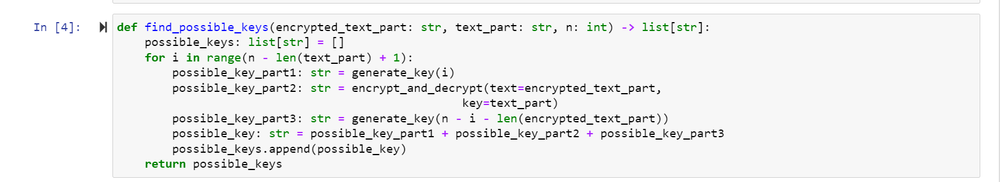
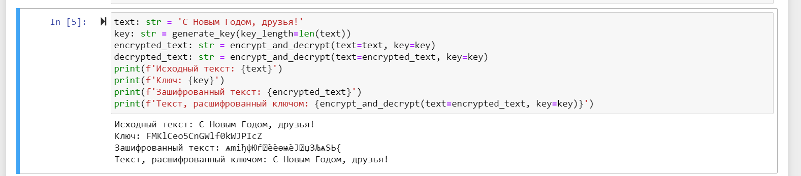
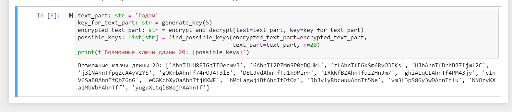

# **Отчет к лабораторной работе №7**
## **Common information**
discipline: Основы информационной безопасности 
group: НПМбд-02-21  
author: Ермолаев А.М.

---
## **Цель работы**

Освоить на практике применение режима однократного гаммирования.

## **Выполнение работы**

Напишем код на языке программирования Python.

Импортируем все необходимые библиотеки:


Напишем функцию для генерации случайного ключа заданной длины:


Напишем функцию для шифорования и дешифрования текста по заданному ключу (реализация одной функции для двух процессов возможна ввиду того, что операция исключающего или отменяет сама себя):


После чего напишем функцию, которая формирует ключ заданной длины, содержащий в себе в качестве фрагмента ключ, расшифровывающий заданные зашифрованный и исходный тексты, который для дешифрования исходного текста: 



Проверим корректность работы написанных нами функций:






В итоге имеем данну программу:

```Python
import random
from string import ascii_letters, digits

def generate_key(key_length: int) -> str:
    return ''.join([random.choice(ascii_letters + digits) for _ in range(key_length)])

def encrypt_and_decrypt(text: str, key: str) -> str:
    if len(key) != len(text):
        raise ValueError('!!! text and key length must be equal !!!')
    return ''.join([chr(ord(text[i]) ^ ord(key[i])) for i in range(len(text))])

def find_possible_keys(encrypted_text_part: str, text_part: str, n: int) -> list[str]:
    possible_keys: list[str] = []
    for i in range(n - len(text_part) + 1):
        possible_key_part1: str = generate_key(i)
        possible_key_part2: str = encrypt_and_decrypt(text=encrypted_text_part, 
                                                  key=text_part)
        possible_key_part3: str = generate_key(n - i - len(encrypted_text_part))
        possible_key: str = possible_key_part1 + possible_key_part2 + possible_key_part3
        possible_keys.append(possible_key)
    return possible_keys

text: str = 'С Новым Годом, друзья!'
key: str = generate_key(key_length=len(text))
encrypted_text: str = encrypt_and_decrypt(text=text, key=key)
decrypted_text: str = encrypt_and_decrypt(text=encrypted_text, key=key)
print(f'Исходный текст: {text}')
print(f'Ключ: {key}')
print(f'Зашифрованный текст: {encrypted_text}')
print(f'Текст, расшифрованный ключом: {encrypt_and_decrypt(text=encrypted_text, key=key)}')

text_part: str = 'Годом'
key_for_text_part: str = generate_key(5)
encrypted_text_part: str = encrypt_and_decrypt(text=text_part, key=key_for_text_part)
possible_keys: list[str] = find_possible_keys(encrypted_text_part=encrypted_text_part,
                                              text_part=text_part, n=20)
print(f'Возможные ключи длины 20: {possible_keys}')
```

## **Ответы на контрольные вопросы**

1) Однократное гаммирование - это метод шифрования, при котором каждый символ открытого текста гаммируется с соответствующим символом ключа только один раз.

2) Недостатки однократного гаммирования:

* Уязвимость к частотному анализу из-за сохранения частоты символов открытого текста в шифротексте.
* Необходимость использования одноразового ключа, который должен быть длиннее самого открытого текста.
* Нет возможности использовать один ключ для шифрования разных сообщений.

3) Преимущества однократного гаммирования:
* Высокая стойкость при правильном использовании случайного ключа.
* Простота реализации алгоритма.
* Возможность использования случайного ключа.

4) Длина открытого текста должна совпадать с длиной ключа, чтобы каждый символ открытого текста гаммировался с соответствующим символом ключа.

5) В режиме однократного гаммирования используется операция XOR (исключающее ИЛИ), которая объединяет двоичные значения символов открытого текста и ключа для получения шифротекста. Особенность XOR - если один из битов равен 1, то результат будет 1, иначе 0.

6) Для получения шифротекста по открытому тексту и ключу каждый символ открытого текста гаммируется с соответствующим символом ключа с помощью операции XOR.

7) По открытому тексту и шифротексту невозможно восстановить действительный ключ, так как для этого нужна информация о каждом символе ключа.

8) Необходимые и достаточные условия абсолютной стойкости шифра:

* Ключи должны быть случайными и использоваться только один раз.
* Длина ключа должна быть не менее длины самого открытого текста.
* Ключи должны быть храниться и передаваться безопасным способом.

## **Вывод**
В рамках выполнения работы я освоил на практике применение режима однократного гаммирования.


## **Список литературы**
* https://bugtraq.ru/library/books/crypto/chapter7/
* https://xakep.ru/2019/07/18/crypto-xor/
* https://www.youtube.com/watch?v=tAjBULW_OjQ


