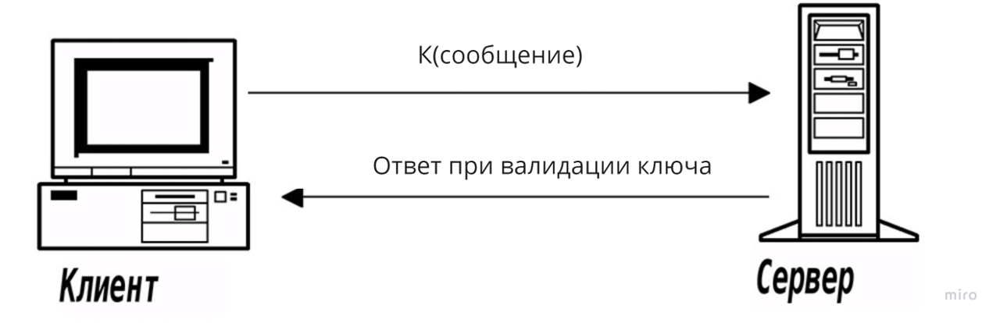
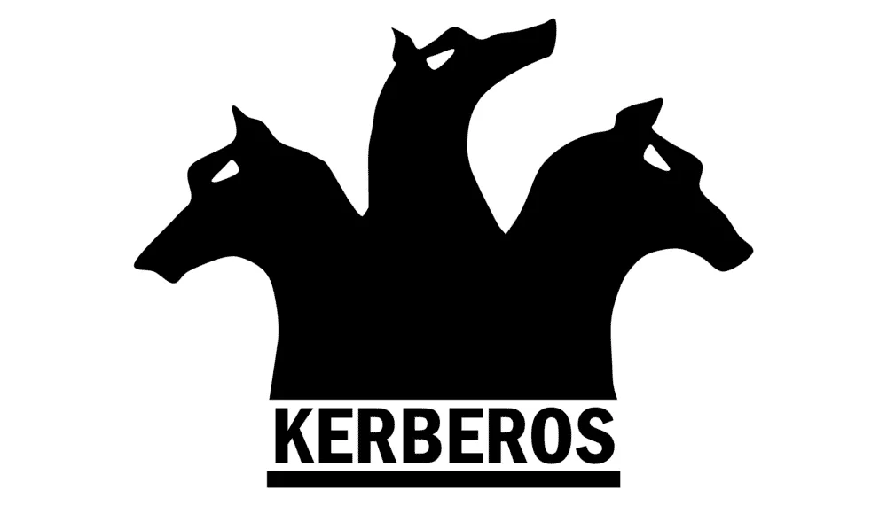
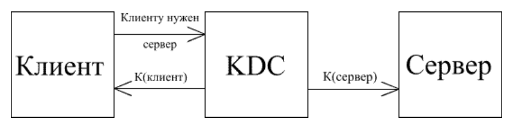
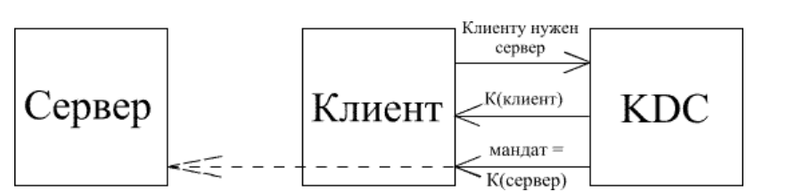
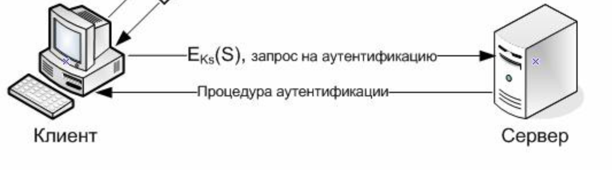
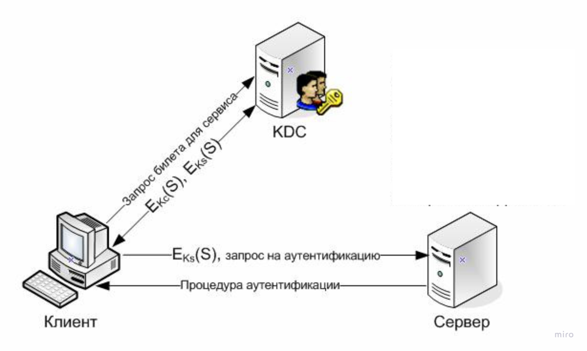

---
## Front matter
lang: ru-RU
title: Презентация
author: Ермолаев А. М.
group: НПМбд-02-21
marp: true
backgroundColor: #b2dfeb

## Formatting
toc: false
slide_level: 2
theme: metropolis
header-includes: 
 - \metroset{progressbar=frametitle,sectionpage=progressbar,numbering=fraction}
 - '\makeatletter'
 - '\beamer@ignorenonframefalse'
 - '\makeatother'
aspectratio: 43
section-titles: true

---

# Протокол Kerberos.

Выполнил: Ермолаев Алексей НПМбд-02-21

---

# Докладчик

* Ермолаев Алексей Максимович
* Российский Университет Дружбы Народов
* Группа - НПМбд-02-21
* № студ. билета - 1032216505

---
# Цель работы

**Цель работы**: ознакомиться с основными концециями сетевого протокола Kerberos и областями его применения.

---

# Введение

* Протокол Kerberos был создан более десяти лет назад в Массачусетском технологическом институте в рамках проекта Athena.

* Протокол Kerberos предлагает механизм взаимной аутентификации клиента и сервера.

* Аутентификация - процесс проверки валидности предоставленной информации.

* В протоколе учтён тот факт, что начальный обмен информацией между клиентом и сервером происходит в незащищённой среде, а передаваемые пакеты могут быть перехвачены и модифицированы, что делает его подходящим для применения в сети Интернет и аналогичных сетях.

---

# Задача аутентификации в модели клиент-серверного взаимодействия

Недостатки данного подхода:
* Ключ должен иметься у взаимодействующих устройств заранее.
* Как у клиента, так и у сервера должно храниться множество ключей.

---

# Протокол Kerberos.

---

# КDC (Key Distribution Center)

* KDC - служба, содержащая **базу данных** с информацией об учётных записях всех главных абонентов безопасности своей области.

* Помимо информации о каждом абоненте безопасности в базе данных KDC сохраняется **криптографический ключ**, известный только этому абоненту и службе KDC, который используется для связи пользователя с центром распределения ключей.

* Для обращения к серверу клиент прежде всего направляет запрос в KDC, который в ответ направляет каждому участнику предстоящего сеанса копии уникального сеансового ключа (session key), действующие в течение короткого времени для аутентиикации.

* Копия сеансового ключа, пересылаемая на сервер, шифруется с помощью долговременного ключа этого сервера, а направляемая клиенту — долговременного ключа данного клиента.

---

# Отправка ключей клиенту и серверу

Недостатки:

* Хранение ключей в памяти обоих устройств
* Зависимость от сетевого трафика

---

# Сеансовые мандаты

* Служба KDC направляет обе копии сеансового ключа клиенту.

* Сеансовый мандат (session ticket) - блок данных, содержащий в зашифрованном виде ключ для сервера вместе с информацией о клиенте.

---
# Процесс аутентификации

* Получив ответ KDC, клиент извлекает из него мандат и свою копию сеансового ключа.

* Сообщение серверу от клиента состоит из мандата, зашифрованного с применением долговременного ключа этого сервера и собственного аутентификатора, зашифрованного посредством сеансового ключа.

* Сервер с помощью своего секретного ключа расшифровывает сеансовый мандат и извлекает из него сеансовый ключ, который затем использует для дешифрования аутентификатора клиента.

---

# Преимущества подхода

* Cерверу не нужно хранить сеансовые ключи для связи с клиентами.
* У клиента нет необходимость обращаться к центру KDC перед каждым сеансом связи с сервером.

<!--  -->

---

# Взаимодейсвтие клиента и KDC

* При регистрации клиент Kerberos пропускает указанный пользователем пароль через функцию одностороннего хеширования, в результате генерируется криптографический ключ.

* Получив запрос от клиента Kerberos, KDC обращается в свою базу данных, находит в ней учетную запись нужного пользователя и извлекает из соответствующего ее поля долговременный соответствующий ключ. Данный процесс происходит единожды.

---

# Мандаты на выдачу мандатов (Ticket-Granting Ticket)

* Мандат на выдачу мандатов (ticket-granting ticket или TGT) - мандат для взаимодействия клиента и KDC. 
* TGT содержит копию сеансового ключа для связи службы центра KDC с клиентом.
* В сообщение с мандатом TGT также включается копия сеансового ключа, с помощью которой клиент может связаться с KDC. 
* Мандат TGT шифруется посредством долговременного ключа службы KDC, а клиентская копия сеансового ключа — с помощью долговременного ключа пользователя.

<!--  -->
---
# Использование TGT

* Перед подключением к любой службе, клиент прежде всего обращается ищет сеансовый мандат нужной службы.

* Если его нет, то ищется мандат TGT. Найдя его, клиент извлекает оттуда же соответствующий сеансовый ключ регистрации и готовит с его помощью аутентификатор, который вместе с мандатом TGT высылает в центр KDC.

* Одновременно В KDC направляется запрос на сеансовый мандат для требуемой службы.

* Организация безопасного доступа к KDC ничем не отличается от организации такого доступа к любой другой службе домена — она требует сеансового ключа, аутентификатора и мандата TGT.

---

# Итоговая схема протокола

---
# Область применения

* Kerberos является методом аутентификации по умолчанию в Windows и играет неотъемлемую роль в Windows Active Directory (AD).
* Kerberos доступен в Apple OS, FreeBSD, UNIX и Linux.
* Веб-приложения могут применять Kerberos в качестве метода аутентификации для клиентов, подключённых к домену, с помощью API.

---

# Список литературы

* ftp.isi.edu/isi-pubs/rs-94-412.pdf — The Evolution of the Kerberos Authentication Service

* www.kerberos.org/docs/index.html - Official Kerberos Documentation

* web.mit.edu/kerberos/www/index.html — Kerberos: The Network Authentication Protocol

---

# Спасибо за внимание!