---
## Front matter
lang: ru-RU
title: Презентация к 1 этапу индивидуального проекта
author: Ермолаев А.М.
group: НПМбд-02-21

## Formatting
toc: false
slide_level: 2
theme: metropolis
header-includes: 
 - \metroset{progressbar=frametitle,sectionpage=progressbar,numbering=fraction}
 - '\makeatletter'
 - '\beamer@ignorenonframefalse'
 - '\makeatother'
aspectratio: 43
section-titles: true
---

# Презентация к к 1 этапу индивидуального проекта

# Цель работы

Цель работы: приобрести практический навык установки операционной системы Kali Linux на виртуальную машину и настройки минимально необходимых для дальнейшей работы сервисов.

# Выполнение работы

## Создание виртуальной машины

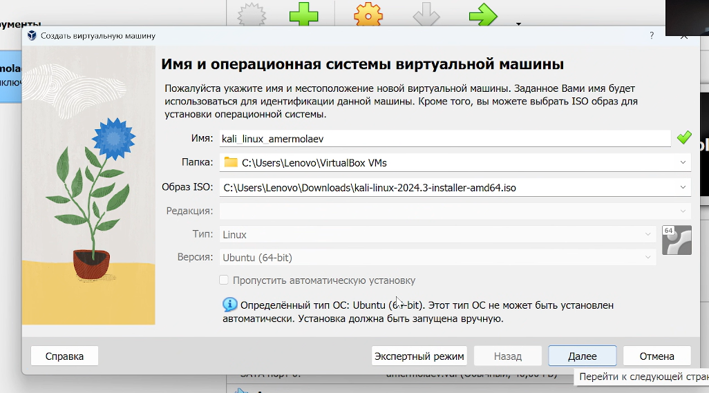

## Настройки машины

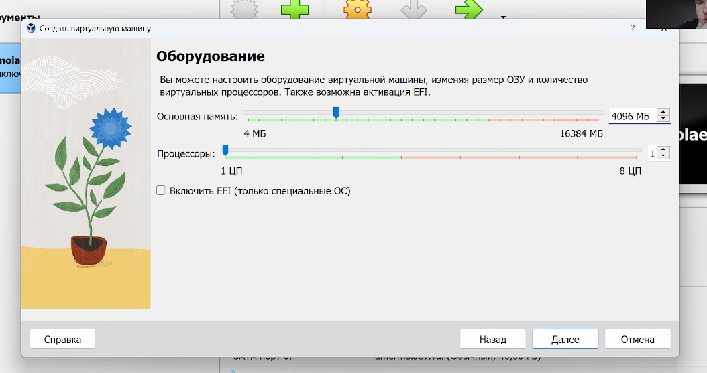

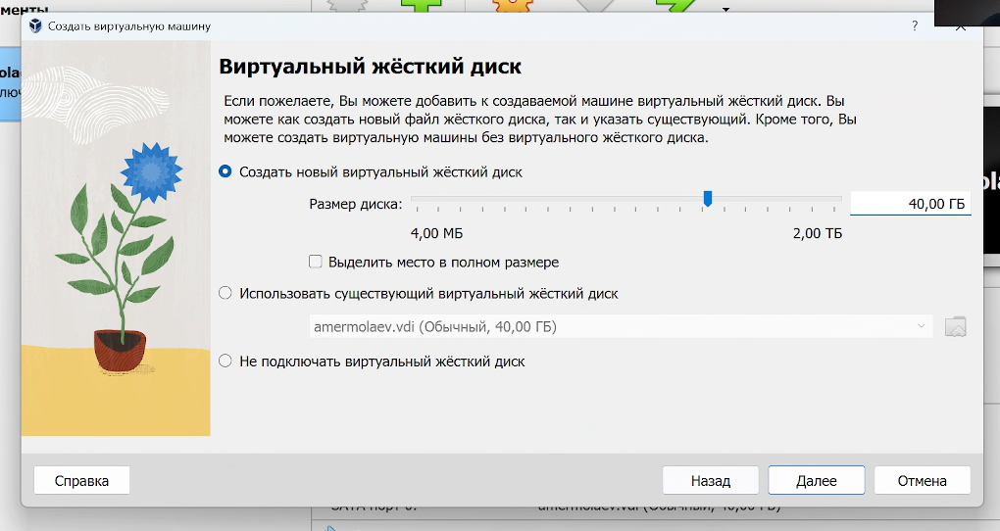

## Графическая установка

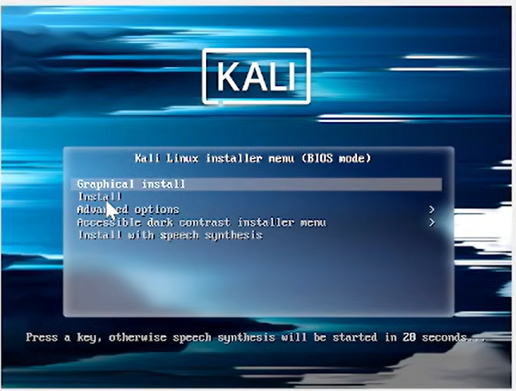

## Язык, местонахождение, клавиатура 

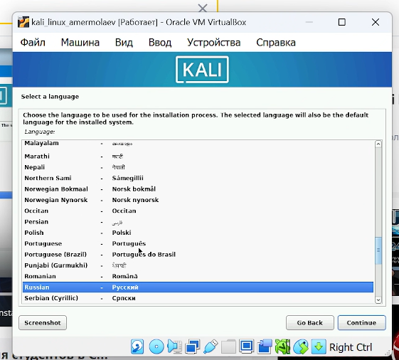

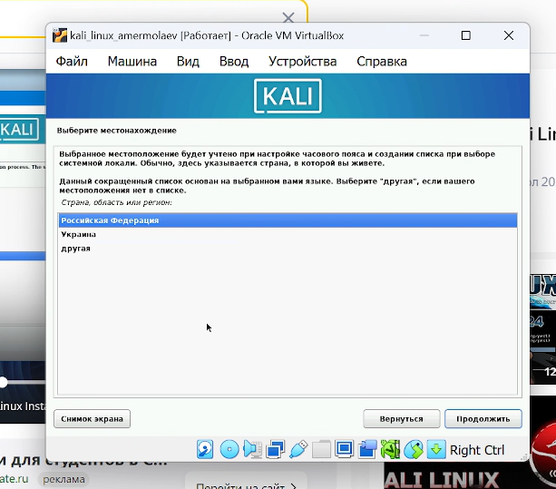

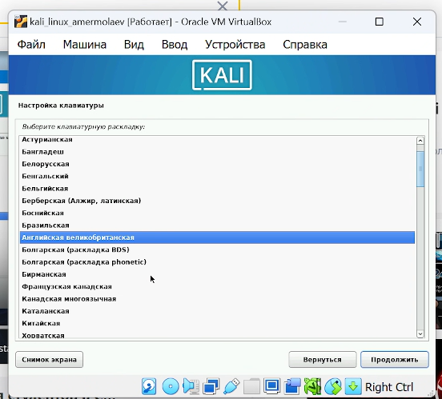

## Сетевые настройки  

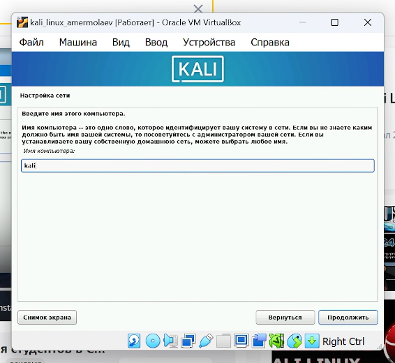

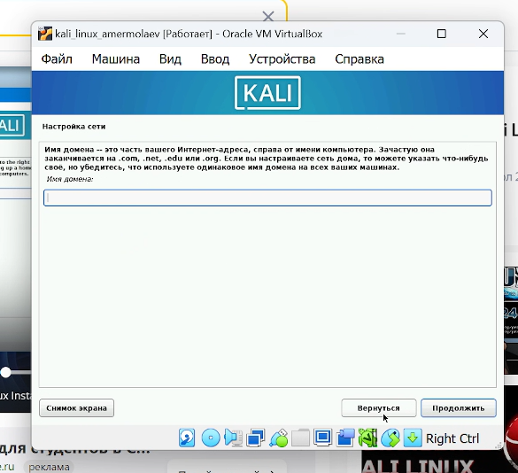

## Создание пользователя

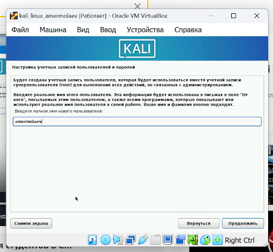
  
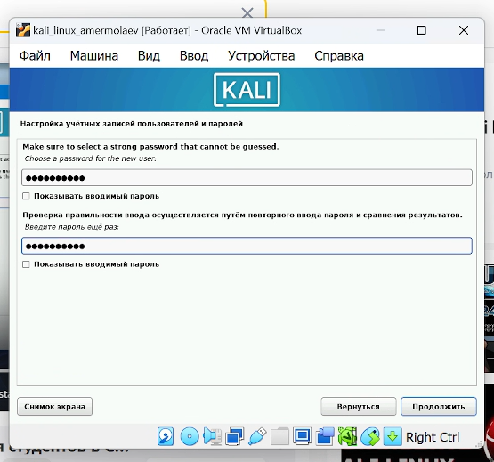

## Часовой пояс

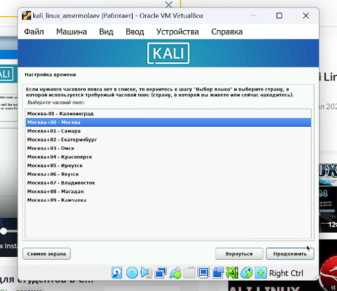

## Разметка диска

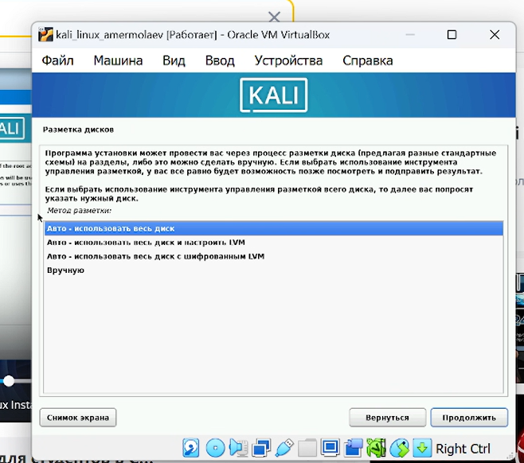

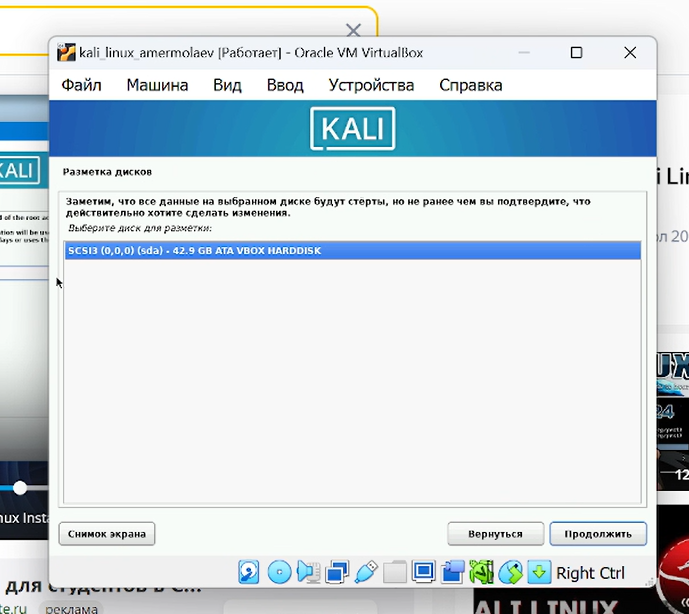

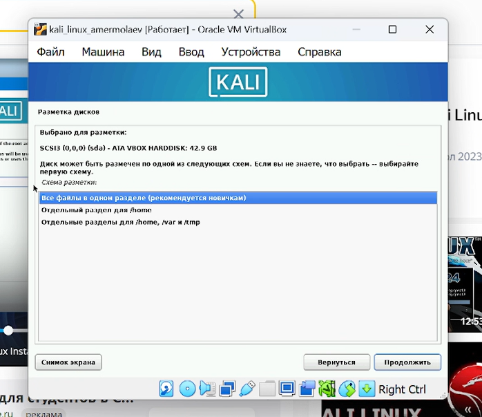

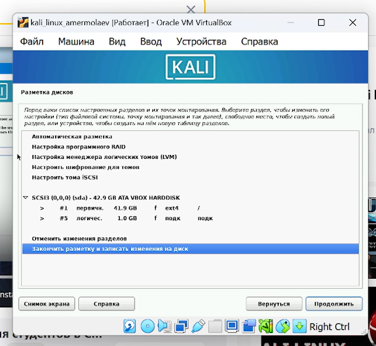

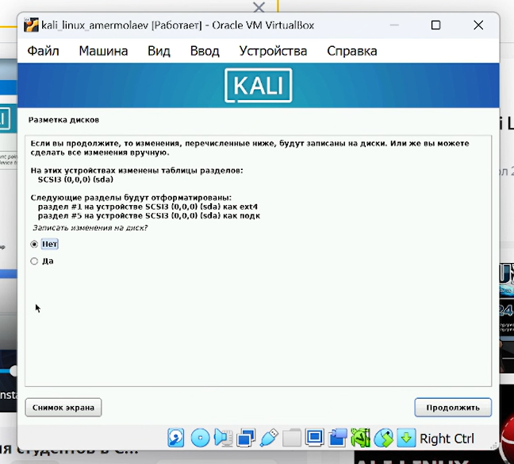

## Выбор программного обеспечения

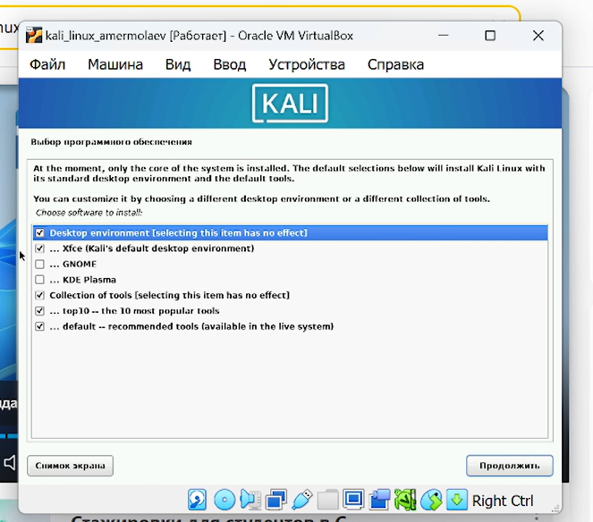

## Настройки gdm3

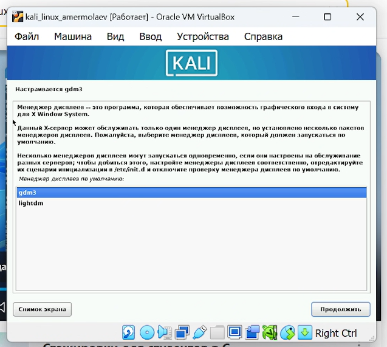

## Системный загрузчик GRUB

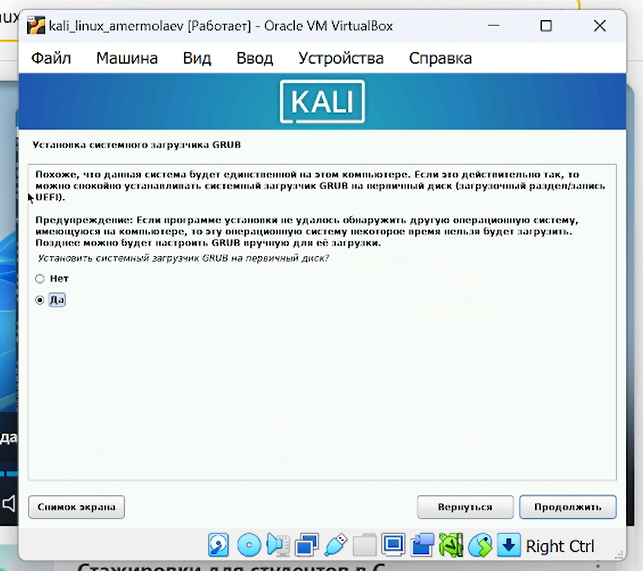

## Окончание установки

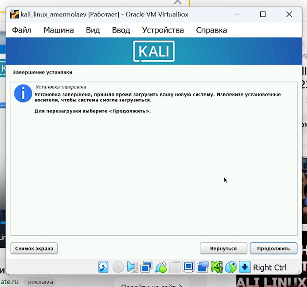

## Вход в систему

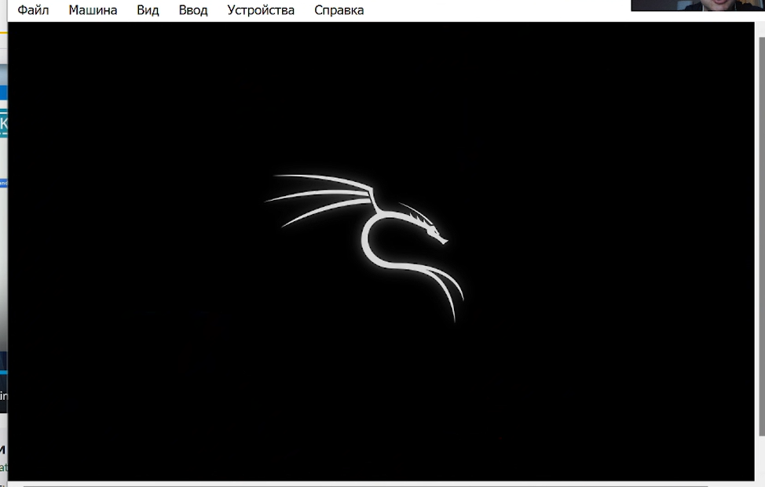

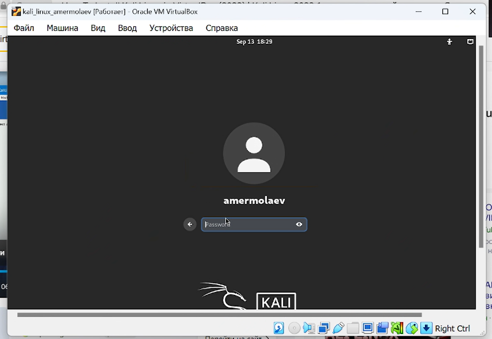

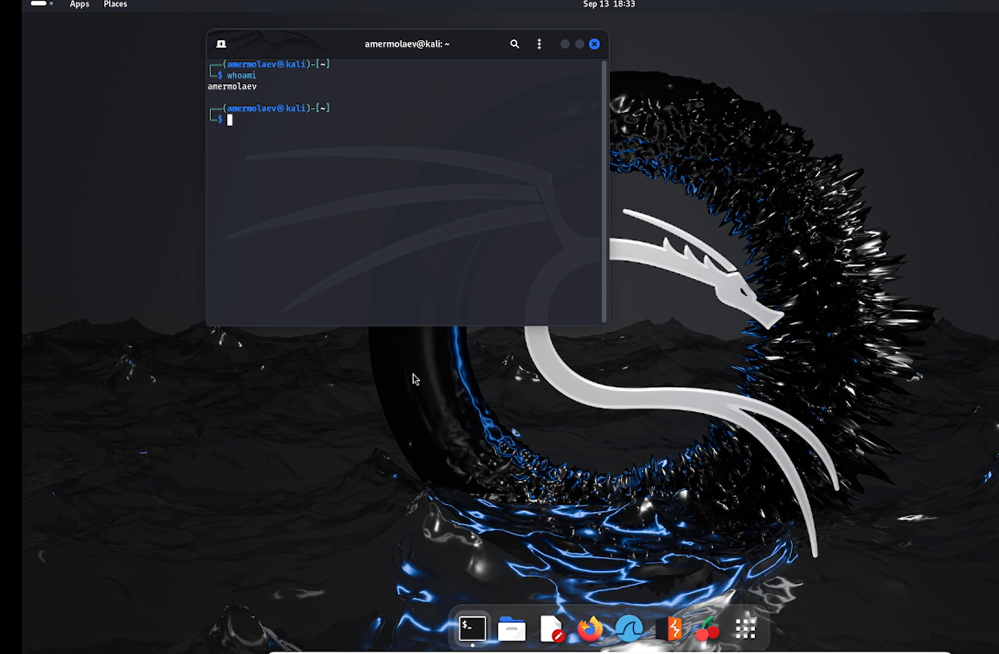

# Вывод
## В рамках выполнения работы я получил практический навык установки операционной системы Kali Linux на виртуальную машину и настройки минимально необходимых для дальнейшей работы сервисов.

# Финал
