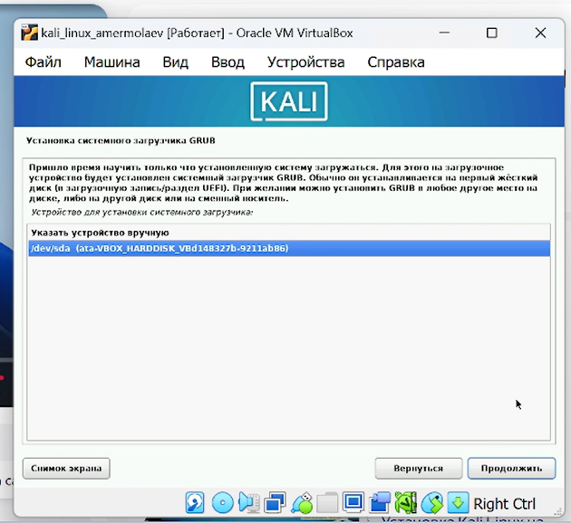

---
## Front matter
lang: ru-RU
title: Презентация к 1 этапу индивидуального проекта
author: Ермолаев А.М.
group: НПМбд-02-21

## Formatting
toc: false
slide_level: 2
theme: metropolis
header-includes: 
 - \metroset{progressbar=frametitle,sectionpage=progressbar,numbering=fraction}
 - '\makeatletter'
 - '\beamer@ignorenonframefalse'
 - '\makeatother'
aspectratio: 43
section-titles: true
---

# Презентация к к 1 этапу индивидуального проекта

# Цель работы

Цель работы: приобрести практический навык установки операционной системы Kali Linux на виртуальную машину и настройки минимально необходимых для дальнейшей работы сервисов.

# Выполнение работы

## Создание виртуальной машины

## Настройки машины

## Графическая установка

## Язык, местонахождение, клавиатура 

## Сетевые настройки  

## Создание пользователя

  

## Часовой пояс

## Разметка диска

## Выбор программного обеспечения

## Настройки gdm3

## Системный загрузчик GRUB

## Окончание установки

## Вход в систему

# Вывод
## В рамках выполнения работы я получил практический навык установки операционной системы Kali Linux на виртуальную машину и настройки минимально необходимых для дальнейшей работы сервисов.

# Финал
