# **Отчет к 1 этапу индивидуального проекта**
## **Common information**
discipline: Основы информационной безопасности  
group: НПМбд-02-21  
author: Ермолаев А.М.
---
---
## **Цель работы**

Приобретение практических навыков установки операционной системы Kali Linux на виртуальную машину и настройки минимально необходимых для дальнейшей работы сервисов.

## **Выполнение работы**

Предварительно скачаем образ виртуальной машины с официального [сайта](https://www.kali.org/get-kali/#kali-installer-images).

Создадим новую виртуальную машину, выбрав опции

```
Машина -> Создать
```

Укажем имя виртуальной машины (kali_linux_amermolaev), тип
операционной системы (Linux, Ubuntu(64-bit)) и загрузим скаченный ранее образ в соответсвующее поле:


Укажем размер основной памяти виртуальной машины - 4096 МБ и кол-во выделенных ядер процессора - 1:


Зададим конфигурацию виртуального жёсткого диска — загрузочный, VDI, динамический, размером 40 ГБ:

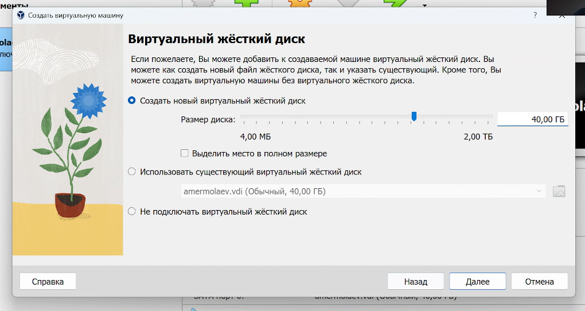

Подтвердим все выбранные настройки и запустим созданную виртуальную машину.

При первом запуске выберем графическую установку:


Выберем язык, местонахождение и настройки клавиатуры: 

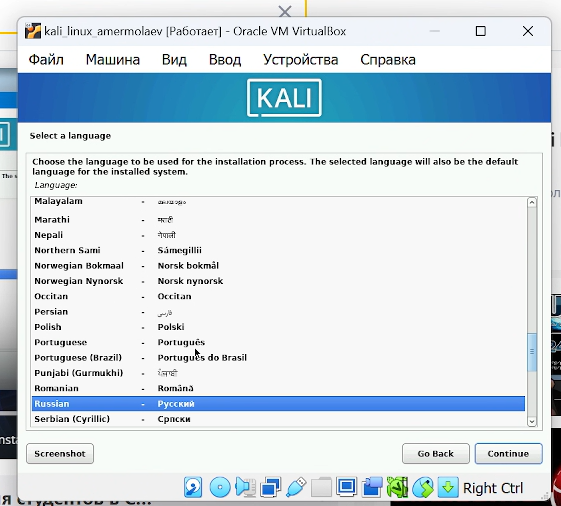

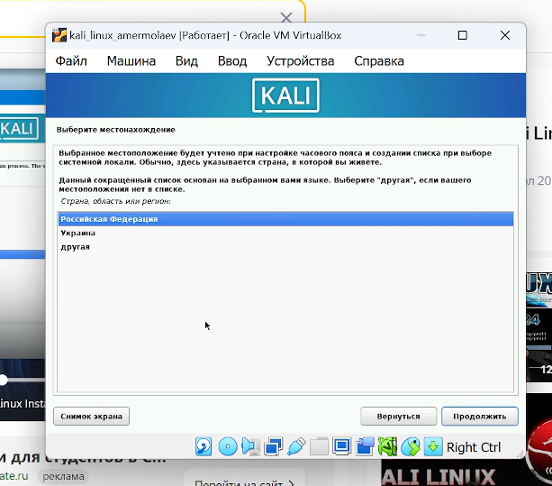


Теперь произведем сетевые настройки: укажем имя компьютера и имя домена оставим пустым: 

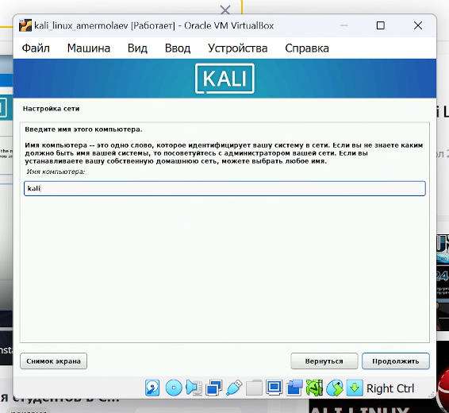

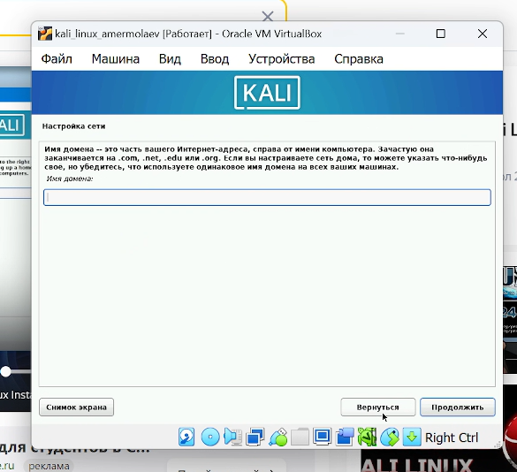

После создадим пользователя для входа в систему:


  
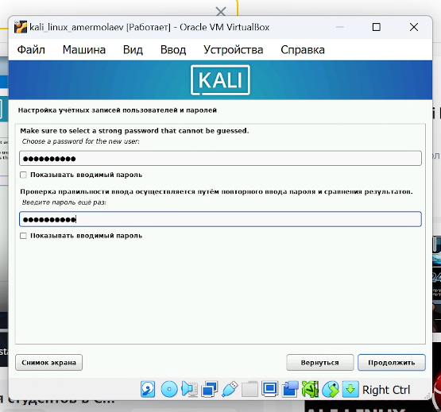

Укажем часовой пояс:


Затем произведем разметку диска, выбирая значения по умолчанию:

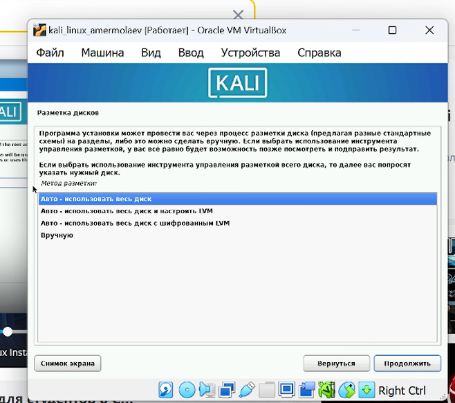


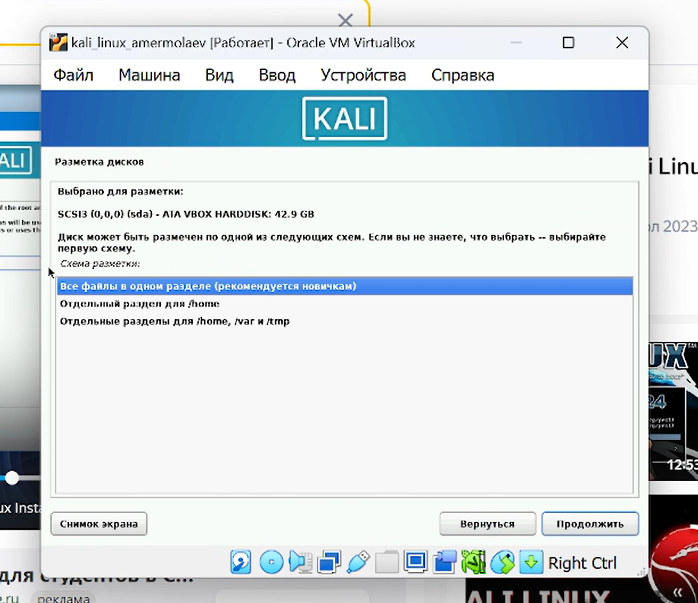


В разделе "Выбор программного обеспечения" выберем первую опцию:

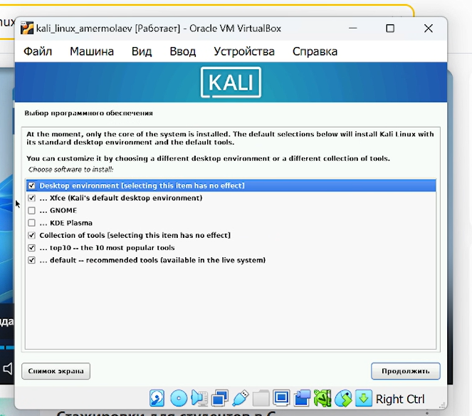

В разделе "Настройки gdm3" проделаем то же самое:

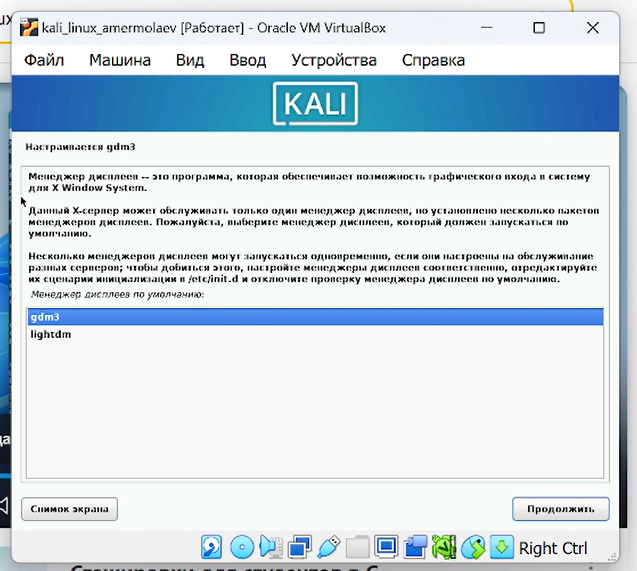

После подтвердим установку системного загрузчика GRUB и выберем путь по умолчанию:

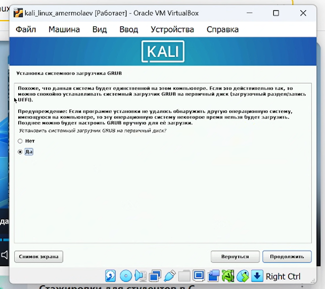


Доджемся установки всех компонентов, после чего кнопкой "Продолжить" перезагрузим ОС.


В случае успешной установки пронаблюдаем приветсвенную анимацию:


Зайдем в систему под ранее созданным пользователем:


Пронаблюдаем графический интерфейс ОС:

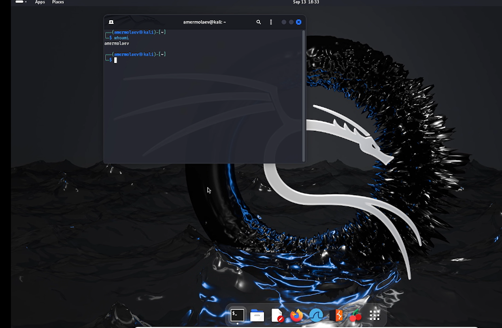

Поздравляю, ОС Kali Linux установлена:


## **Вывод**
В рамках выполнения работы я получил практический навык установки операционной системы Kali Linux на виртуальную машину и настройки минимально необходимых для дальнейшей работы сервисов.

## **Список литературы** ##
* https://www.virtualbox.org/
* https://www.kali.org/get-kali/#kali-installer-images
* https://rutube.ru/video/3d7bc73ed94db37a8d2243e3cd3b032f/
* https://lumpics.ru/installing-kali-linux-on-virtualbox/


