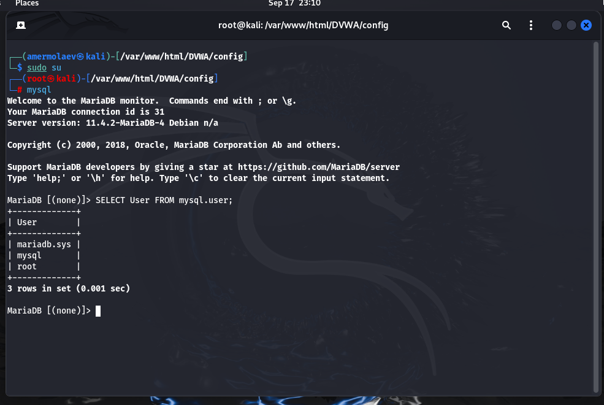

---
## Front matter
lang: ru-RU
title: Презентация ко 2 этапу индивидуального проекта
author: Ермолаев А.М.
group: НПМбд-01-21

## Formatting
toc: false
slide_level: 2
theme: metropolis
header-includes: 
 - \metroset{progressbar=frametitle,sectionpage=progressbar,numbering=fraction}
 - '\makeatletter'
 - '\beamer@ignorenonframefalse'
 - '\makeatother'
aspectratio: 43
section-titles: true
---

# Презентация ко 2 этапу индивидуального проекта

# Цель работы

Приобретение практического навыка установки и развертывания веб-приложения DVWA в гостевую систему к Kali Linux.

# Выполнение работы

## Клонирование репозитория

## Копирование содержимого файла

## Содержание файла config.inc.php  

## Запуск сервиса MySQL

## Вход в оболочку MySQL

## Создание базы данных и пользователя

## Настройка и запуск веб-сервера apache2

## Форма авторизации

## Создание баз данных

## Развернутое приложение

# Вывод
## В рамках выполнения работы я получил практический навык установки и развертывания веб-приложения DVWA в гостевую систему к Kali Linux.

# Финал

