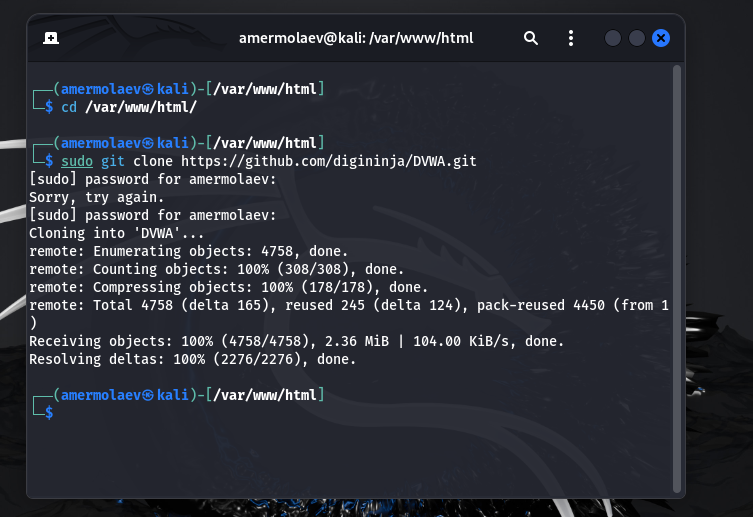
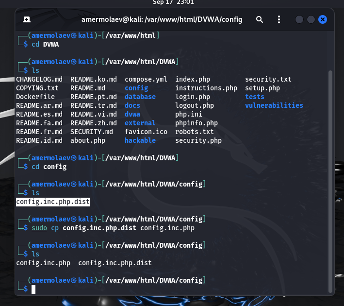
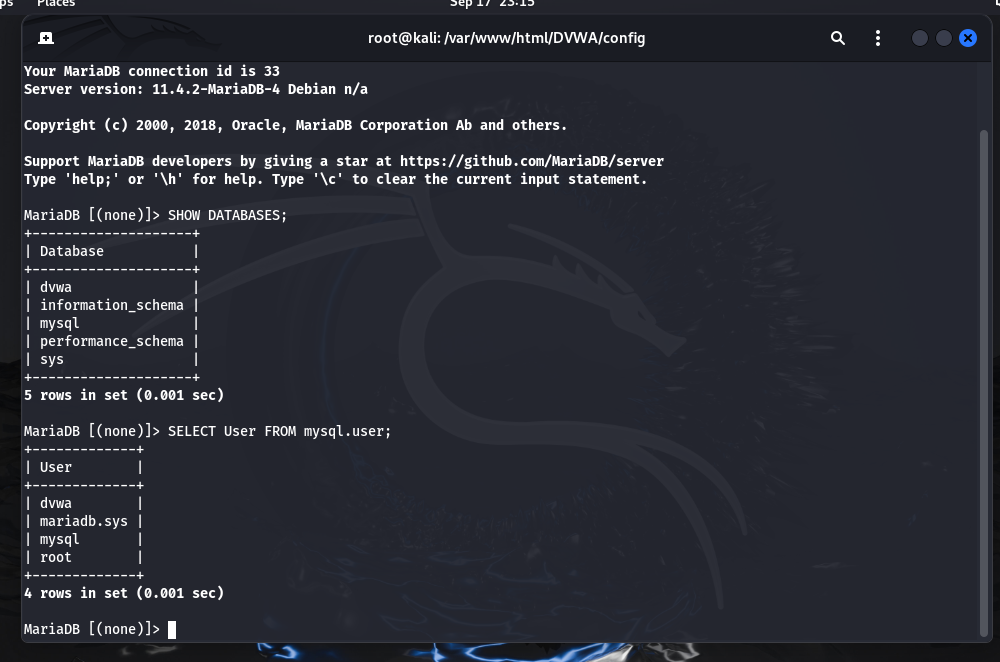
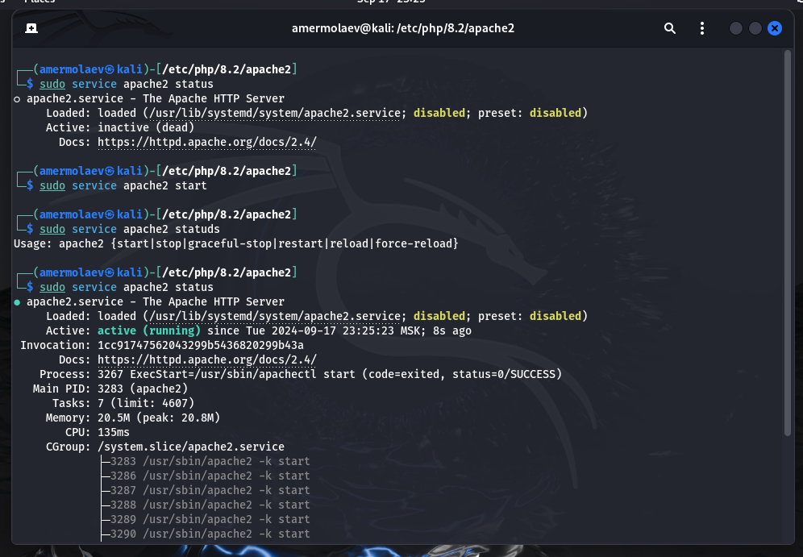
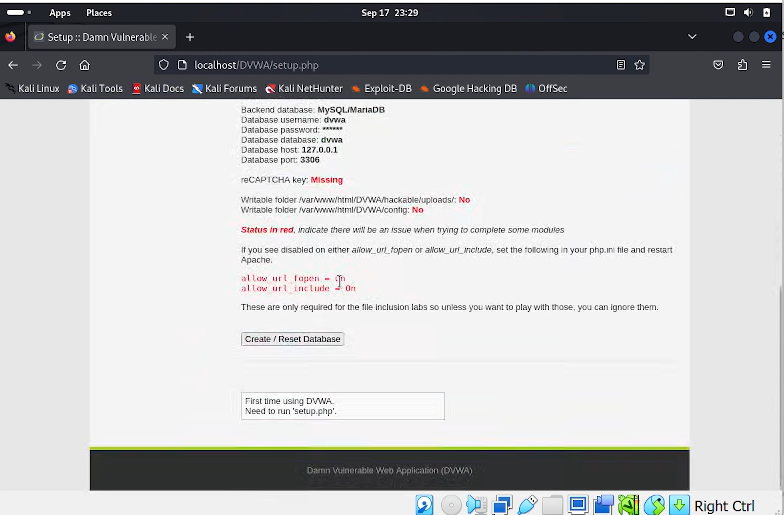

# **Отчет ко 2 этапу индивидуального проекта**
## **Common information**
discipline: Основы информационной безопасности  
group: НПМбд-02-21  
author: Ермолаев А.М.
---
---
## **Цель работы**

Приобретение практического навыка установки и развертывания веб-приложения DVWA в гостевую систему к Kali Linux.

## **Выполнение работы**

Перейдем в директорию /var/www/html/ и склонируем репозиторий командой

```
sudo git clone https://github.com/digininja/DVWA.git
```



Перейдем в директорию config и скопируем содержимое файла config.inc.php.dist в файл 
config.inc.php командой

```
cp config.inc.php.dist config.inc.php
```



Откроем файл командой

```
nano  config.inc.php
```


Как видим, файл содержит конфигурацию для подключения к СУБД MySQL как к СУБД по умолчанию.

По умолчанию в Kali Linux установлена данная СУБД (за это респект), поэтому нам нужно лишь запустить запустить процесс командой

```
sudo service mysql start
```

и посмотреть работу командой

```
sudo service mysql status
```


Теперь перейдем к созданию базы данных и пользователя в соответствии с файлом config.inc.php:





После мы должны внести изменение в конфигурационный файл php.ini веб-сервера apache2 (который нам на радость установлен в Kali Linux по умолчанию).

Для корректной работы переменные allow_url_include и allow_url_fopen должны иметь значение On.


Запустим процесс веб-сервера аналогично MySQL: 




Теперь перейдем по адресу http://127.0.0.1/DVWA/login.php.

В форму авторизации введем  имя пользовтеля admin и пароль password:


Перейдя на страницу приложения, прокрутим ее вниз до кнопки "Create / Reset Database" и нажмем на нее, после чего авторизуемя повторно:



Итак, веб-приложение DVWA развернуто.


## **Вывод**

В рамках выполнения работы я получил практический навык установки и развертывания веб-приложения DVWA в гостевую систему к Kali Linux.

## **Список литературы** ##
* https://github.com/digininja/DVWA?tab=readme-ov-file
* https://www.kali.org/
* https://www.youtube.com/watch?v=WkyDxNJkgQ4
* https://kali.tools/?p=1820