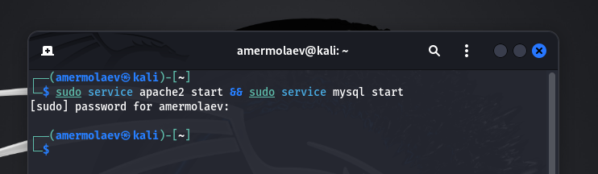
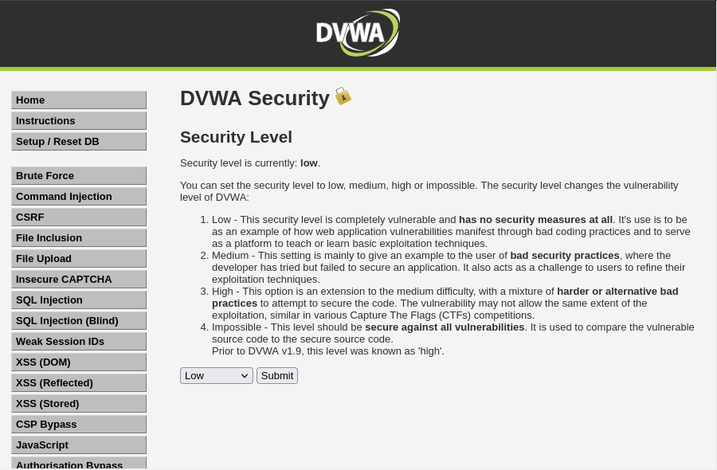
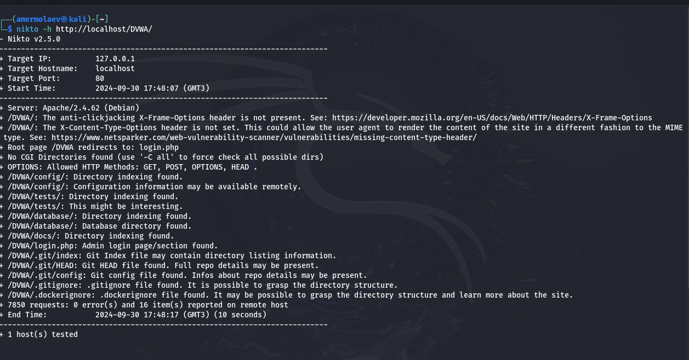
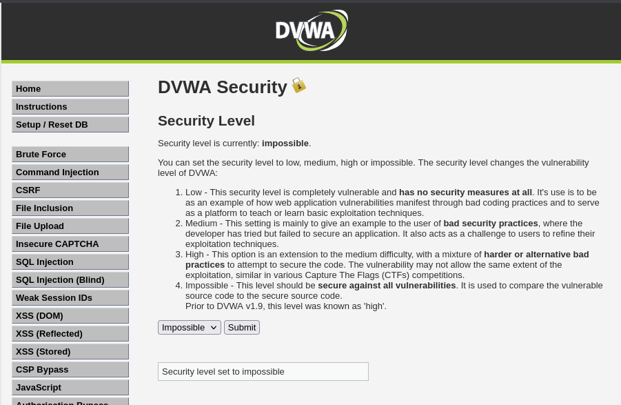
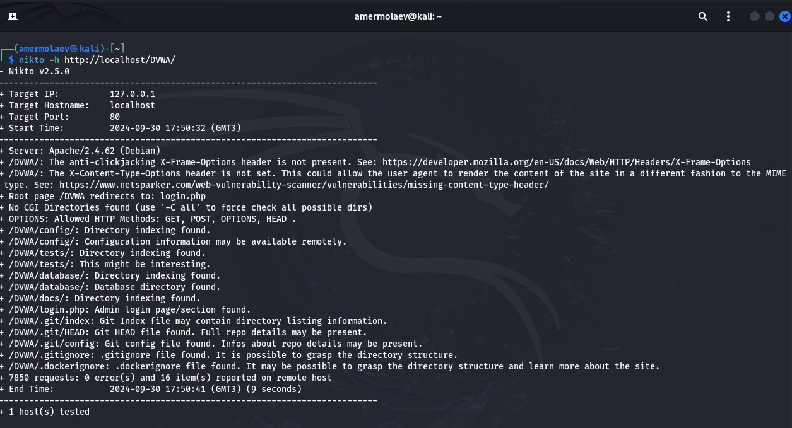

---
## Front matter
lang: ru-RU
title: Презентация к 3 этапу индивидуального проекта
author: Ермолаев А.М.
group: НПМбд-01-21

## Formatting
toc: false
slide_level: 2
theme: metropolis
header-includes: 
 - \metroset{progressbar=frametitle,sectionpage=progressbar,numbering=fraction}
 - '\makeatletter'
 - '\beamer@ignorenonframefalse'
 - '\makeatother'
aspectratio: 43
section-titles: true
marp: true
backgroundColor: #16c9e0

---

# Презентация к 4 этапу индивидуального проекта
---

## Цель работы: приобрести практический навык по использованию инструмента nikto - базового сканера безопасности веб-сервера.

---

# Выполнение работы

---

## Запуск сервисов

---

## Изменение настроек безопасности

---

## Утилита nikto

---

## Повторное изменение настроек безопасности

---

## Повторный запуск утилиты

---

# Вывод
## В рамках выполнения работы я приобрел практический навык по использованию инструмента nikto - базового сканера безопасности веб-сервера.

---
# Финал

