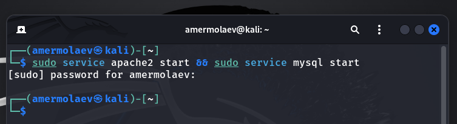
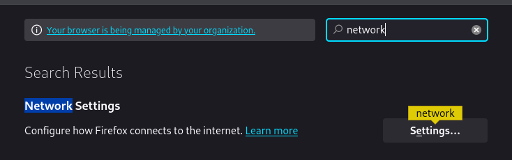
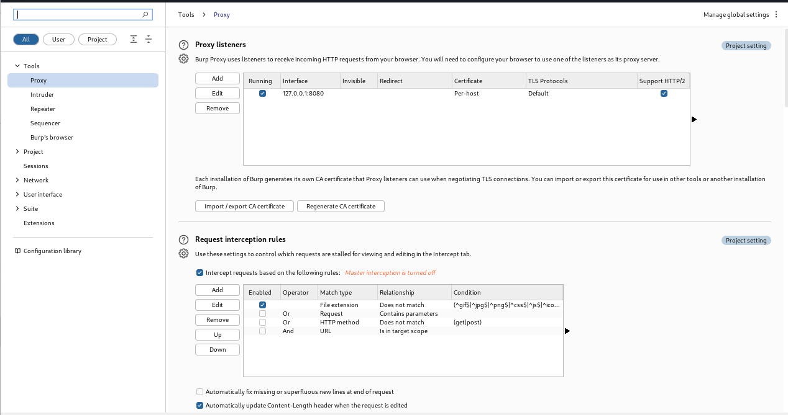
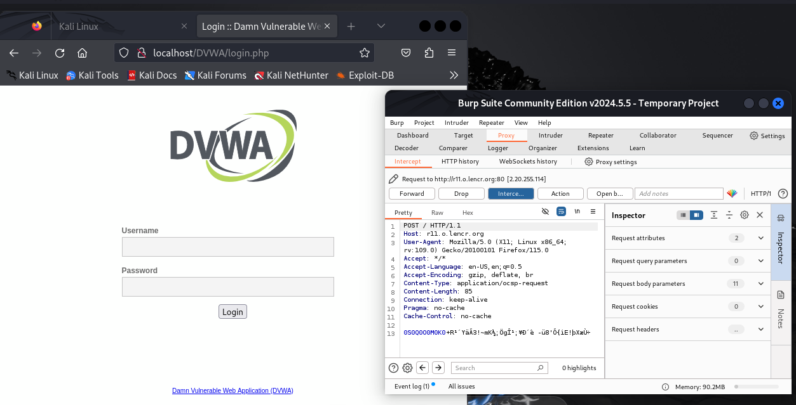
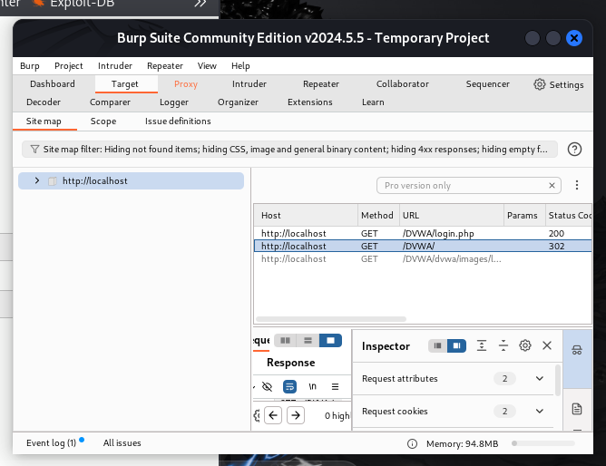
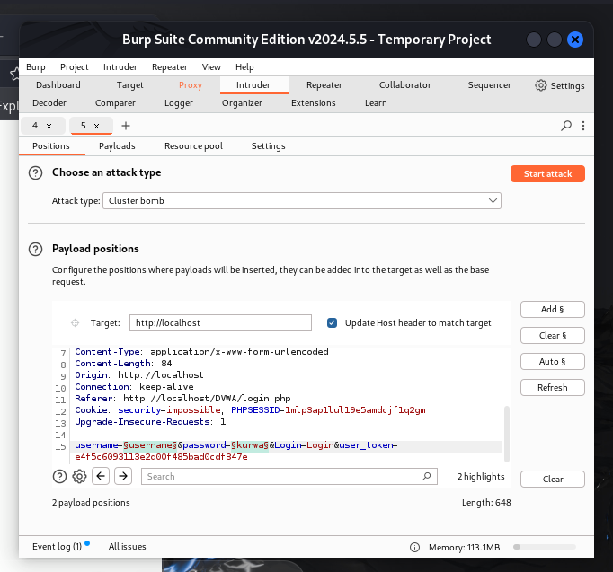
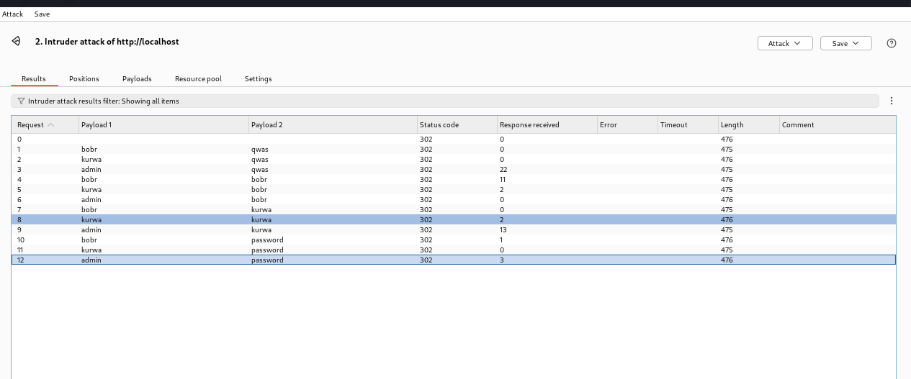
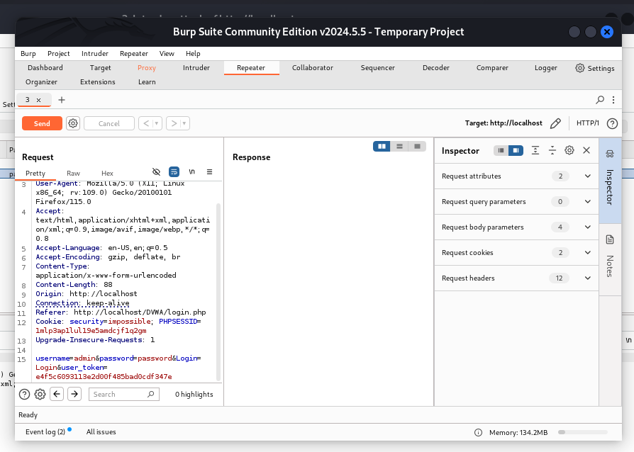

---
## Front matter
lang: ru-RU
title: Презентация к 5 этапу индивидуального проекта
author: Ермолаев А.М.
group: НПМбд-01-21

## Formatting
toc: false
slide_level: 2
theme: metropolis
header-includes: 
 - \metroset{progressbar=frametitle,sectionpage=progressbar,numbering=fraction}
 - '\makeatletter'
 - '\beamer@ignorenonframefalse'
 - '\makeatother'
aspectratio: 43
section-titles: true
marp: true
backgroundColor: #16c9e0

---

# Презентация к 5 этапу индивидуального проекта
---

## Цель работы: приобрести практический навык по использованию инструмента Burp Suite - набора мощных инструментов безопасности веб-приложений.

---

# Выполнение работы

---

## Запуск сервисов

---

## Запуск Barp Suite

---

## Настройки проекта

---
## Настройки проекта

---

## Настойка браузера

---
## Настойка браузера

---

## Настройки в Burp Suite

---

## Внедрение Burp Suite

---

## Изменение переменных браузера

---

## Перехваченный запрос

---

## Загрузка страницы

---

## Раздел Target

---

## Перехват отправки формы

---

## Попытка подбора логина и пароля

---

## Подбор логина

---

## Подбор пароля

---

## Имитация атаки

---

## Имя скрипта

---

## Вкладка Repeater

---

## Разметка страницы авторизации

---

## Раздел Render

---

# Вывод
## В рамках выполнения работы я приобрел практический навык по использованию инструмента Burp Suite - набора мощных инструментов безопасности веб-приложений.

---
# Финал

