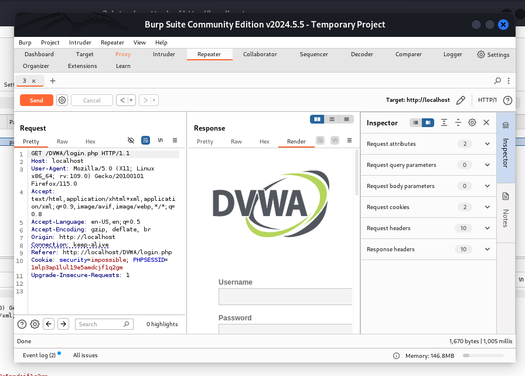

# **Отчет к 5 этапу индивидуального проекта**
## **Common information**
discipline: Основы информационной безопасности  
group: НПМбд-02-21  
author: Ермолаев А.М.
---
---
## **Цель работы**

Приобретение практических навыков по использованию инструмента Burp Suite - набором мощных инструментов безопасности веб-приложений, которые демонстрируют реальные возможности злоумышленника, проникающего в веб-приложения.

## **Выполнение работы**

Для работы приложения запустим сервисы Apache2 и MySQL:


Теперь запустим Burp Suite командой

```
barpsuit
```


Создадим проект в оперативной памяти и выберем настройки по умолчанию:


Теперь для интеграции с браузером произведем его настройки в разделе ```Settings```


Настроим прокси:


Теперь перейдем в Burp Suite и проверим настройки страницы и прокси:


Перейдем во вкладку ```Proxy``` и включим внедрение Burp Suite:


Также не забудем задать переменной ```network_allow_hijacking_loacalhost``` значение ```true```:


Перейдем по адресу ```http://localhost/DWVA/```.
Страница прогружается, а во вкладке ```Proxy``` появляется захваченный запрос:


Нажмем кнопку ```Forward```, чтобы загрузить страницу:


Все запросы можно найти в разделе ```Target```:


Попробуем ввести невалидные данные в форму  нажмем кнопку ```Login```. В окне Burp Suite появятся введеные в поля формы значения:


Попробуем подобрать логин пароль для аутентификации. Для этого в разделе ```Target``` нажмем на запрос правой кнопкой мыши и в меню выберем ```Send to intruder```.

Во вкладке ```Intruder``` выберим тип атаки и ```Cluster Bomb``` и выделим значения специальным символом:


Заполним произвольные значения логинов и паролей в двух списках:


и нажмем кнопку ```Start attack```:


Выберем верную пару логина и и пароля (admin и password), увидев имя скрипта, отрабатываемый при отправке формы:


Откроем данный запрос в разделе ```Repeater``` и нажмем кнопку ```Send```:


В правом окне увидим знакомый нам вывод, однако, нажав кнопку ```Follow redirections```, получим ответ с разметкой страницы с формой авторизации:


Отобразим ее в разделе ```Render```:



## **Вывод**

В рамках выполнения работы я приобрел практические навыки по использованию инструмента Burp Suite - набора мощных инструментов безопасности веб-приложений, которые демонстрируют реальные возможности злоумышленника, проникающего в веб-приложения.

## **Список литературы** ##
* https://github.com/digininja/DVWA?tab=readme-ov-file
* https://www.kali.org/
* https://habr.com/ru/companies/yandex_praktikum/articles/770668/
* https://blog.eldernode.com/configure-burp-suite-on-kali-linux/